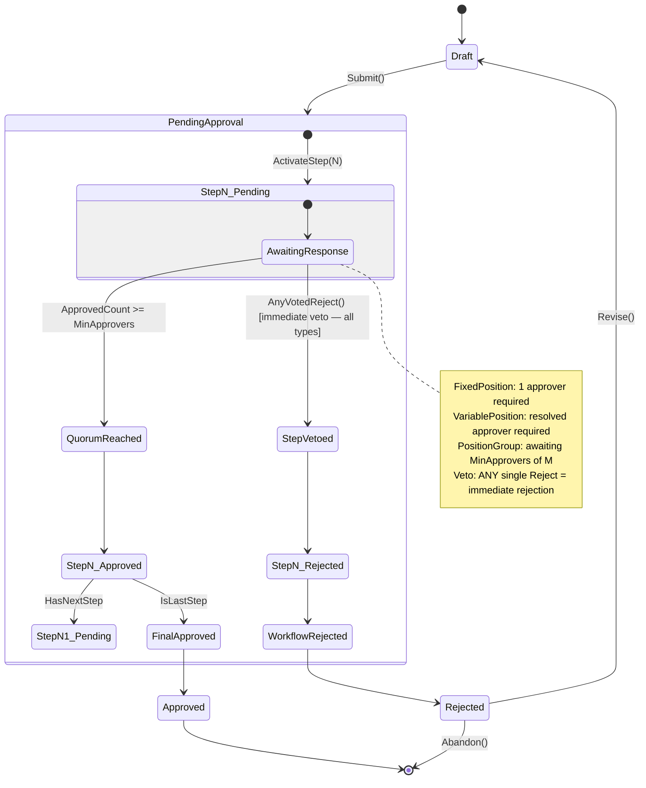
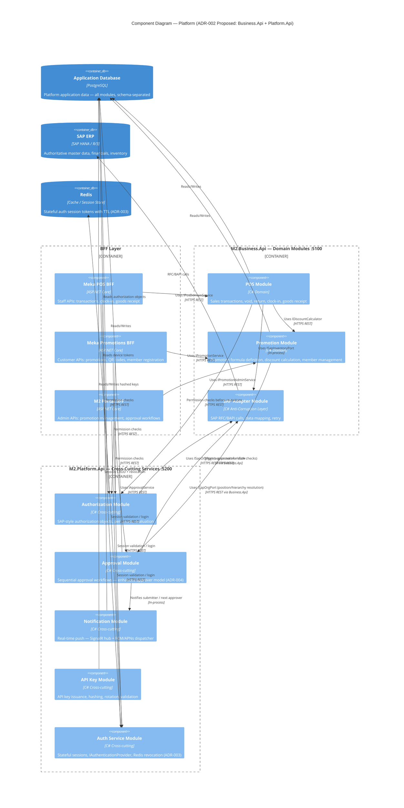
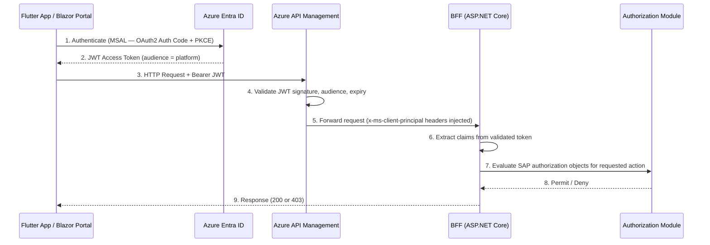
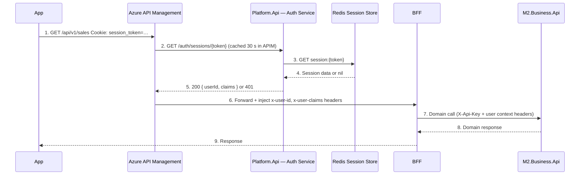

# Platform Architecture — POS & Enterprise Platform

> **Author:** Keyser (Lead / Architect)
> **Date:** 2026-05-12
> **Status:** Approved — Foundational (Core) | Proposal — Pending Review (ADR-002, ADR-003, ADR-004)

---

## Table of Contents

1. [Executive Summary](#1-executive-summary)
2. [Architecture Decision Records](#2-architecture-decision-records)
   - [ADR-001: Architecture Style Decision](#adr-001-architecture-style-decision)
   - [ADR-002: Cross-Cutting Service Decoupling *(Proposal)*](#adr-002-cross-cutting-service-decoupling-proposal)
   - [ADR-003: Stateful Authentication *(Proposal)*](#adr-003-stateful-authentication-proposal)
   - [ADR-004: Enhanced Approval Approver Model *(Proposal)*](#adr-004-enhanced-approval-approver-model-proposal)
3. [System Context Diagram](#3-system-context-diagram)
4. [Component Diagram](#4-component-diagram)
5. [BFF Pattern Design](#5-bff-pattern-design)
6. [Authentication & Authorization Architecture](#6-authentication--authorization-architecture)
   - [Local Development Authentication](#local-development-authentication)
7. [Container Architecture](#7-container-architecture)
8. [Cross-Cutting Services Design](#8-cross-cutting-services-design)
   - [8.4 Operation Behavior Pipeline](#84-operation-behavior-pipeline)
9. [SAP Integration Architecture](#9-sap-integration-architecture)
10. [Technology Stack Recommendation](#10-technology-stack-recommendation)
11. [Security Architecture](#11-security-architecture)

---

## 1. Executive Summary

This platform is a **greenfield enterprise layer** built on top of an existing SAP system, delivering enriched digital capabilities across multiple applications — beginning with the POS system. The chosen architecture is a **Modular Monolith with explicit bounded contexts**, deployed as a container-first application behind a BFF (Backend for Frontend) per client. Each client (Meka Promotion App, Meka POS, M2 Portal) has its own BFF to ensure interface stability and independent evolution.

**Current (Approved):** Cross-cutting platform services — Authorization, Approval, Notification, and API Key — are hosted within the `M2.Business.Api` process alongside domain modules (POS, Promotion, SAP Adapter). BFFs communicate with all modules via REST/HTTPS to `M2.Business.Api`.

**Proposed (ADR-002):** Cross-cutting services will be extracted to a new `M2.Platform.Api` process (port :5200), separating operational profiles. Business domain modules (POS, Promotion, SAP Adapter) remain in `M2.Business.Api`. The topology grows from 4 to 5 independent processes.

**Proposed (ADR-003):** Authentication evolves from stateless JWT-only (Azure Entra ID hard-coupled) to a stateful session model with Redis-backed revocation and an `IAuthenticationProvider` abstraction supporting any OIDC/OAuth2-compliant identity provider.

**Proposed (ADR-004):** The Approval Service's approver model is extended from a single fixed `RequiredPositionCode` to a three-type approver definition supporting fixed positions, dynamically resolved variable positions, and group quorum voting.

SAP integration is mediated through a dedicated Adapter module. The architecture is deliberately chosen for team size, delivery speed, and the risk profile of a greenfield system — decomposition-ready from day one.

---

## 2. Architecture Decision Records

### ADR-001: Architecture Style Decision

### Status
**Accepted** — 2026-05-12 | **Final decision:** 4 processes (3 BFFs + 1 Platform API), communicate via HTTPS REST

### Context

We are building a greenfield enterprise platform that:
- Sits on top of an existing SAP ERP system
- Serves 3 front-end clients with different interaction patterns (mobile Flutter apps + Blazor portal)
- Has cross-cutting concerns: auth, approval workflows, push notifications
- Requires BFF per client (mandated)
- Must be container-capable
- Is developed by a small, focused team (≤ 10 engineers)
- Has no existing runbook, no operational expertise in distributed systems yet

### Options Evaluated

#### Option A: Microservices
**Description:** Each bounded context is an independently deployable service — Authorization Service, Approval Service, Notification Service, SAP Adapter, POS Domain Service — each with its own database, container, and API surface.

| Gain | Cost |
|------|------|
| Independent deployability per service | Distributed systems complexity from day 1 |
| Independent scaling | Service-to-service network calls, latency, retry logic |
| Technology heterogeneity if needed | Cross-service transactions require Saga/Outbox patterns |
| Clear ownership per team | Operational overhead: K8s, service mesh, distributed tracing required immediately |
| | Integration testing is significantly harder |

**Verdict for this context:** Premature. The team has not yet established domain boundaries through working software. Microservices require operational maturity that does not yet exist here. The distributed systems tax — retries, eventual consistency, distributed tracing, saga orchestration — would dominate early sprints and delay business value delivery.

#### Option B: Modular Monolith (Chosen)
**Description:** Platform Core (`M2.Business.Api`) is an independent process; each BFF is its own independent process. Internal module boundaries within `M2.Business.Api` are enforced by code structure. BFFs communicate with Business.Api via **HTTPS REST with `X-Api-Key`** — not in-process. Each module owns its own data model within a shared database (schema-per-module or table-prefix separation).

| Gain | Cost |
|------|------|
| Full transactional consistency in-process | Single deployment unit — cannot scale individual modules independently |
| No distributed systems complexity | Requires discipline to maintain module boundaries in code |
| Fast local developer experience | Shared database can become a coupling point if not disciplined |
| Easy cross-cutting: DI wiring, shared middleware | A poorly written module can destabilize the whole |
| Deployable as a container — container-first, not container-only | |
| Can be split into services when operational evidence demands it | |
| Team can move fast and refactor across modules without service contracts | |

**Verdict:** This is the correct choice for this team, at this stage, for this problem. It provides the speed of a monolith with the architectural discipline of microservices — if boundaries are respected.

#### Option C: Hybrid (Modular Monolith + Selective Services)
**Description:** Core platform stays modular monolith. High-demand or high-risk components are broken out: e.g., Notification Service becomes standalone because it uses SignalR and needs persistent WebSocket connections; SAP Adapter becomes standalone because SAP calls are slow and unpredictable.

| Gain | Cost |
|------|------|
| Pragmatic decomposition where it matters | Still introduces distributed systems complexity for extracted services |
| Notification and SAP isolation benefits are real | Team must manage two operational models simultaneously |

**Verdict:** Architecturally sound, but introduces premature complexity. We accept this as the **target evolution path** — not the starting point. When evidence arrives that a module needs to be extracted (load, team ownership, failure isolation), we extract it. We will design internal interfaces now so that extraction is a rename, not a redesign.

### Decision

**We choose Option B: Modular Monolith**, with a clear internal module structure and the explicit intention to extract bounded contexts as standalone services when operational evidence demands it.

The architecture is **decomposition-ready**: every bounded context has an interface boundary, its own data namespace, and its own service registration. Extracting a module into a standalone service is an operational decision, not a redesign.

### Consequences

- Internal module boundaries **must** be enforced via C# project references (a module may not directly call another module's internal types — only its public interface)
- Each module has its own EF Core `DbContext` or `ModelBuilder` configuration — no cross-module entity navigation
- Cross-module communication is via injected interfaces, **never** direct class instantiation across boundaries
- BFF projects call `M2.Business.Api` via typed HTTP clients (`IXxxModuleClient`) configured in `M2.Infrastructure/InterModule/` — they do not reach into domain internals. Communication is HTTPS REST with `X-Api-Key` header.
- When a module grows beyond the team's comfort: extract it into a standalone service behind the same interface — no BFF changes required
- Team must review module boundaries quarterly and make explicit decisions to keep or extract

---

### ADR-002: Cross-Cutting Service Decoupling *(Proposal)*

> **Status:** Proposal — Pending Review | **Date:** 2026-05-27 | **Author:** Keyser

#### Context

`M2.Business.Api` currently hosts two fundamentally different categories of concern in a single process:

- **Domain modules** (POS, Promotion, SAP Adapter) — business logic tied to specific bounded contexts; change with feature delivery cadence; schema-heavy; tightly coupled to PostgreSQL writes.
- **Cross-cutting modules** (Authorization, Approval, Notification, API Key) — infrastructure services consumed by all domain modules and all BFFs; change on a different lifecycle (security patches, operational improvements); often read-heavy with aggressive caching.

The risk of co-location: a destabilizing change to a domain module (e.g., a migration lock, an OOM in the SAP Adapter's retry storm, a bad Promotion discount rule) can disrupt Authorization and Notification services for the entire platform. Equally, a hot-patch to the Authorization module forces redeployment of all domain logic.

#### Options Evaluated

**Option A: Keep co-located (status quo)**

| Gain | Cost |
|------|------|
| No new deployment unit | Domain outages ripple into cross-cutting services |
| Simpler config, single container | Cannot scale cross-cutting services independently |
| No inter-service latency | Cannot evolve auth/approval independently of domain releases |

**Option B: Extract Cross-Cutting to `M2.Platform.Api` (Proposed)**

| Gain | Cost |
|------|------|
| Failure isolation — domain crash cannot destabilize auth/approval | One additional process; one additional container; one additional port |
| Independent scaling (auth may need more replicas than POS module) | `Business.Api` must call `Platform.Api` for permission checks — adds one network hop (~0.2–1 ms localhost / ACA-internal) |
| Independent deployment lifecycle | BFFs must be configured with two base URLs instead of one |
| Clear operational boundary for security review | Requires `Platform.InterModule` typed HTTP client layer |
| Cross-cutting services are consumed by all 3 BFFs and Business.Api — centralising them in a dedicated process prevents duplication | |

**Option C: Full Microservices (one process per module)**

| Gain | Cost |
|------|------|
| Maximum isolation | 8+ independent deployments; distributed transactions; Saga/Outbox everywhere |
| Independent scaling per service | Requires service mesh, distributed tracing, team ops maturity not yet earned |

**Verdict:** Option C is premature. Option B is a targeted, evidence-motivated decomposition — not speculative. The operational profiles differ; the blast radius argument is clear; the cost is exactly one new process.

#### Decision

**Extract cross-cutting modules to `M2.Platform.Api`** running on port **:5200**.

**`M2.Business.Api` (port :5100) hosts:**
- POS Module
- Promotion Module
- SAP Adapter Module

**`M2.Platform.Api` (port :5200) hosts:**
- Authorization Module
- Approval Module
- Notification Module
- API Key Module

#### Communication Rules (Post-Split)

| Caller | Target | Transport | Auth |
|--------|--------|-----------|------|
| BFF → Business.Api | Domain modules | HTTPS REST | `X-Api-Key` |
| BFF → Platform.Api | Auth checks, approvals, notifications | HTTPS REST | `X-Api-Key` |
| Business.Api → Platform.Api | Permission evaluation, approval triggers | HTTPS REST | `X-Internal-Secret` header |
| Platform.Api → DB | Authorization objects, approval workflows | EF Core / TCP | PostgreSQL connection string |

BFFs configure two HTTP base URLs:
```
Business__BaseUrl=https://business-api:8080      # domain modules
Platform__BaseUrl=https://platform-api:8080   # auth, approval, notification
```

#### Consequences

- `M2.Platform.Api` is a new ASP.NET Core 9 process, same tech stack
- `M2.Infrastructure/CrossCuttingModule/` or a new `M2.Platform.Infrastructure` project provides typed clients
- All three BFFs add `Platform:BaseUrl` and `Platform:ApiKey` config values
- `M2.Business.Api` registers a typed `IPlatformModuleClient` for inbound permission checks before executing domain mutations
- Migration path: module endpoint registrations move from `M2.Business.Api/Program.cs` to `M2.Platform.Api/Program.cs` — no domain logic changes required
- **ACA topology:** `platform-api` container app with internal ingress; `business-api` calls it via ACA-internal DNS

#### SAP Adapter: Single ACL in M2.Business.Api

The SAP Adapter is a **domain concern** — it translates SAP business objects into platform domain types. It lives in `M2.Business.Api` as a module and is the **single SAP connection point** for the entire platform.

**Decision:** `M2.Platform.Api` (cross-cutting services) must **never** connect to SAP directly. Any SAP-sourced data required by cross-cutting services (org hierarchy for position resolution in approval workflows; org chart for authorization checks) is obtained by calling `M2.Business.Api` REST endpoints:

```
M2.Platform.Api accesses SAP-sourced data via:
  GET /modules/org/positions/{userId}/superior    ← ISapOrgPort on Business.Api (for superior_of_requester resolution)
  GET /modules/org/hierarchy/{userId}             ← org tree for authorization context
```

**Why this allocation:**

| Concern | Business.Api | Platform.Api |
|---------|-------------|-------------|
| SAP Adapter (ACL) | ✅ Owns — domain concern; translates SAP business objects | ❌ Never — no direct SAP connection |
| Org/position queries | Exposes via `ISapOrgPort` REST endpoints | Calls Business.Api REST — one network hop (~0.2–1 ms ACA-internal) |
| Authorization org data | Source of truth | Consumer via REST |
| Approval position resolution | Source of truth (`superior_of_requester`) | Consumer via REST |

**Trade-off:**
- ✅ Single SAP ACL: one translation layer, one connection pool, one Polly circuit breaker
- ✅ Clear ownership: Business.Api is the sole SAP authority
- ⚠️ Platform.Api adds one internal network hop for org data — acceptable (~0.2–1 ms ACA-internal DNS)
- ⚠️ If Business.Api is unavailable, Platform.Api cannot resolve dynamic approver positions — approval *submission* is blocked until Business.Api recovers
- **Mitigation:** Cache resolved position data in Platform.Api `IMemoryCache` (5 min TTL) to tolerate brief Business.Api unavailability without blocking ongoing workflows

---

### ADR-003: Stateful Authentication *(Proposal)*

> **Status:** Proposal — Pending Review | **Date:** 2026-05-27 | **Author:** Keyser

#### Context

Current authentication is **stateless JWT** via Azure Entra ID:
- APIM validates JWT signature, audience, expiry
- No server-side session store; token validity is purely cryptographic
- **Hard-coupled to Azure Entra ID** — `Microsoft.Identity.Web` in all three BFFs; switching identity providers requires code changes in three projects
- **No revocation** — a JWT issued for 1 hour remains valid for its full lifetime even if the user is terminated, a security incident occurs, or an admin forces re-auth
- **No SSO coordination** — each BFF independently validates tokens; no unified session concept across BFFs

Required capabilities:
1. **Immediate revocation** — invalidate a session in < 1 second for any user, from any admin interface
2. **Provider abstraction** — decouple from Entra ID specifically; support Keycloak, Auth0, custom OIDC in future with a config change, not a code change
3. **SSO across BFFs** — a single authenticated session valid for Meka POS, Meka Promotions, and M2 Portal simultaneously

#### Options Evaluated

**Option A: Keep stateless JWT (status quo)**

| Gain | Cost |
|------|------|
| No infrastructure change | No revocation capability |
| Lowest latency (no session lookup) | Hard-coupled to Entra ID |
| Industry standard for public APIs | No cross-BFF SSO |

**Option B: Stateful Sessions with Redis + Opaque Tokens (Proposed)**

| Gain | Cost |
|------|------|
| Immediate revocation (delete from Redis — propagates in < 1 s) | Redis required as infrastructure dependency |
| Provider-agnostic via `IAuthenticationProvider` | Session lookup adds ~0.5–2 ms per request (Redis RTT) |
| SSO: one session token valid across all BFFs via APIM | Session store is a new availability dependency |
| Opaque token: no claims leakage; token itself has no information value | More complex than stateless |
| Short-TTL refresh tokens can be combined for defence-in-depth | |

**Option C: JWT + Revocation Blocklist**

| Gain | Cost |
|------|------|
| Keeps stateless JWT structure | Blocklist grows unboundedly unless TTL-pruned |
| Revocation possible (check blocklist per request) | Still provider-coupled unless abstraction is added separately |
| Lower latency than full session lookup | Blocklist check cost ≈ same as session lookup — no net win |

**Verdict:** Option B is the correct investment. The revocation requirement alone disqualifies Option A; the provider-abstraction requirement is cleaner as a first-class design goal rather than a bolt-on. Option C's blocklist is functionally equivalent to a session store but less explicit and harder to reason about.

#### Decision

**Adopt stateful authentication with Redis-backed opaque session tokens**, hosted in `M2.Platform.Api` (per ADR-002) as the Auth Service module.

#### Session Token Design

```
Session Token (opaque)
  ├── Value: 256-bit CSPRNG (base64url-encoded, 43 chars)
  ├── Storage: Redis hash key = "session:{token}"
  │     Fields: UserId, TenantId, IdentityProvider, IssuedAt, ExpiresAt, Claims (JSON)
  ├── TTL: 8 hours (configurable; sliding renewal on activity)
  └── Binding: not bound to IP or device (support mobile roaming)
```

**Why opaque over signed JWT for sessions:** Opaque tokens have zero information value if intercepted (no claims payload); revocation is a single Redis `DEL`; no risk of algorithm confusion or `alg:none` attacks.

#### `IAuthenticationProvider` Interface

```csharp
/// <summary>
/// Abstracts identity provider interaction — token validation, claim extraction, refresh.
/// Implementations: EntraIdAuthenticationProvider, KeycloakAuthenticationProvider, etc.
/// </summary>
public interface IAuthenticationProvider
{
    /// <summary>Validates an IdP-issued token and extracts normalized claims.</summary>
    Task<AuthenticationResult> ValidateTokenAsync(string idpToken, CancellationToken ct = default);

    /// <summary>Exchanges a refresh token for a new access token at the IdP.</summary>
    Task<TokenRefreshResult> RefreshTokenAsync(string refreshToken, CancellationToken ct = default);

    /// <summary>Provider identifier — used for routing and audit logging.</summary>
    string ProviderName { get; }
}

public record AuthenticationResult(
    bool IsValid,
    string UserId,
    string TenantId,
    string Email,
    IReadOnlyList<string> Roles,
    IDictionary<string, string> AdditionalClaims,
    string? FailureReason = null
);
```

**Registered implementations:**
- `EntraIdAuthenticationProvider` — default; wraps `Microsoft.Identity.Web` token validation
- `KeycloakAuthenticationProvider` — future; validates Keycloak JWT via JWKS endpoint
- Provider selected per BFF by `Authentication:Provider` config key

#### Session Lifecycle

```mermaid
sequenceDiagram
    participant App as Flutter App / Blazor Portal
    participant APIGW as Azure API Management
    participant BFF as BFF
    participant AuthSvc as Platform.Api — Auth Service
    participant IdP as IAuthenticationProvider (e.g. Entra ID)
    participant Redis as Redis Session Store

    App->>IdP: 1. Authenticate via OIDC/OAuth2 (MSAL or equivalent)
    IdP-->>App: 2. IdP access token (short-lived, IdP-issued)
    App->>APIGW: 3. POST /auth/login  { idp_token }
    APIGW->>BFF: 4. Forward to BFF login endpoint
    BFF->>AuthSvc: 5. POST /auth/sessions  { idp_token, provider }
    AuthSvc->>IdP: 6. ValidateTokenAsync(idp_token)
    IdP-->>AuthSvc: 7. AuthenticationResult (userId, claims)
    AuthSvc->>Redis: 8. SET session:{token}  { userId, claims, expiresAt }  EX 28800
    AuthSvc-->>BFF: 9. { session_token, expires_at }
    BFF-->>App: 10. Set-Cookie: session_token=…; HttpOnly; Secure; SameSite=Strict

    Note over App,Redis: Subsequent requests
    App->>APIGW: 11. GET /api/v1/sales  Cookie: session_token=…
    APIGW->>AuthSvc: 12. GET /auth/sessions/{token}  (validate)
    AuthSvc->>Redis: 13. GET session:{token}
    Redis-->>AuthSvc: 14. Session data (or nil if revoked/expired)
    AuthSvc-->>APIGW: 15. 200 { userId, claims } or 401
    APIGW->>BFF: 16. Forward request + x-user-id, x-user-claims headers
    BFF-->>App: 17. Response
```

#### Revocation Endpoints

| Endpoint | Actor | Behaviour |
|----------|-------|-----------|
| `POST /auth/sessions/{token}/revoke` | Admin (M2 Portal) | Deletes session from Redis immediately; all subsequent requests with this token return 401 |
| `POST /auth/logout` | User (any BFF) | Deletes the caller's own session token from Redis |
| `POST /auth/sessions/revoke-all?userId={id}` | Admin | Deletes all sessions for a user (Redis `SCAN` + `DEL` by `userId` index) |

**Redis secondary index for user-level revocation:**
```
SET member:sessions:{userId} → Set<sessionToken>
```
Maintained alongside the primary session key. `revoke-all` deletes the set and each referenced session key atomically via Lua script.

#### SSO Across BFFs

Single session token issued by `Platform.Api` is valid for all three BFFs. APIM validates the session token against `Platform.Api` on every request regardless of which BFF the request targets. The session payload includes a `scope` or `apps` claim if per-app restrictions are required in future.

```
User logs in via MekaPosBff
  → Session token issued
  → Same token presented to MekaPromosBff and M2PortalBff
  → APIM validates against same Redis store → same user context
```

#### Impact on APIM

| Before (ADR-003) | After (ADR-003) |
|------------------|-----------------|
| APIM validates JWT signature locally (Entra ID JWKS) | APIM calls `GET /auth/sessions/{token}` on Platform.Api |
| Token validity = cryptographic + expiry | Token validity = Redis key existence + TTL |
| No revocation | Revocation propagates in < 1 s |
| Entra ID hard-coupled | Any `IAuthenticationProvider` implementation |

**APIM policy change:** Replace `validate-jwt` policy with `send-request` policy to Platform.Api `/auth/sessions/{token}`. Cache the validation response in APIM cache for 30 s (configurable) to reduce Redis load on high-traffic paths.

#### Consequences

- Redis becomes a required infrastructure dependency (ACA sidecar or Azure Cache for Redis)
- `Platform.Api` owns the session store; it is the single point of auth truth for the platform
- All three BFFs remove `Microsoft.Identity.Web` JWT middleware from request pipeline; they receive pre-validated user context from APIM-injected headers
- `EntraIdAuthenticationProvider` preserves current IdP without behaviour change — migration is a config toggle
- Session token must be transmitted as `HttpOnly; Secure` cookie (web) or `Authorization: Bearer {token}` header (mobile) — opaque to client either way
- APIM validation policy adds ~1–2 ms latency on first lookup per 30 s window (cached thereafter)
- Auth module EF schema (`auth.*`) added to Platform.Api's database partition

---

### ADR-004: Enhanced Approval Approver Model *(Proposal)*

> **Status:** Proposal — Pending Review | **Date:** 2026-05-27 | **Author:** Keyser

#### Context

The current `ApprovalStep` model holds a single `RequiredPositionCode: string` — a fixed, static position that must approve. This cannot express:

1. **Dynamic positions** — "the requester's direct superior" is not a fixed position code; it resolves to different people depending on who submitted the request and their place in the org hierarchy
2. **Group / quorum approval** — "any 2 of [Store Manager, Area Manager, Finance Head] must approve" is a common governance pattern for high-value transactions

These are not edge cases — the promotion approval workflow already requires the branch manager of the requester's branch, which is a dynamic resolution. Without this extension, every workflow template must be duplicated per branch.

#### Options Evaluated

**Option A: Parameterize `RequiredPositionCode` with template variables**

Replace `"STORE_MANAGER"` with `"BRANCH_MANAGER:{branch_id}"` resolved at runtime.

| Gain | Cost |
|------|------|
| Minimal schema change | String interpolation is fragile; no type safety |
| Backward compatible | Group quorum not expressible |
| Quick to implement | Variable syntax is implicit and undocumented |

**Option B: `ApprovalStepDefinition` value object with typed `ApproverType` enum (Proposed)**

Introduce a first-class type discriminator with typed fields per approver category.

| Gain | Cost |
|------|------|
| Type-safe; compiler-enforced by approver type | More schema surface (discriminated union in DB) |
| All three patterns expressible in one model | `IPositionResolver` interface must be implemented |
| Quorum logic is explicit and testable | Slightly more complex step-response tracking |
| Extensible — new approver types added without breaking existing steps | |

**Option C: Separate tables per approver type**

`FixedPositionStep`, `VariablePositionStep`, `GroupPositionStep` as distinct tables.

| Gain | Cost |
|------|------|
| Clean schema per type | Polymorphic queries require UNION across tables |
| No nullable columns | Workflow engine must switch on type |

**Verdict:** Option B. A discriminated-union value object with a nullable-column DB representation (common EF pattern) is the industry standard for this pattern. Option C's table split introduces JOIN complexity in the workflow engine. Option A is insufficient for quorum.

#### Decision

**Extend `ApprovalStep` to use `ApprovalStepDefinition`**, a value object with an `ApproverType` discriminator. Introduce `IPositionResolver` for dynamic resolution. Add `ApprovalStepResponse` for group quorum tracking.

#### Updated Data Model

```
ApprovalWorkflow
  Id              : Guid
  EntityType      : string          ← "Promotion", "GoodsReceipt", etc.
  EntityId        : Guid
  Status          : ApprovalStatus  ← Draft | PendingApproval | Approved | Rejected | Cancelled
  SubmitterId     : Guid
  CreatedAt       : DateTimeOffset
  UpdatedAt       : DateTimeOffset

ApprovalStep
  Id              : Guid
  WorkflowId      : Guid            ← FK → ApprovalWorkflow
  StepOrder       : int             ← 1-based sequential
  Status          : StepStatus      ← Pending | Approved | Rejected | Skipped
  ActivatedAt     : DateTimeOffset? ← when this step became active
  CompletedAt     : DateTimeOffset? ← when step reached terminal state

  ── ApprovalStepDefinition (embedded value object) ──
  ApproverType        : ApproverType  ← FixedPosition | VariablePosition | PositionGroup
  PositionCode        : string?       ← populated when ApproverType = FixedPosition
  PositionVariable    : string?       ← populated when ApproverType = VariablePosition
  EligiblePositionCodes : string[]?   ← populated when ApproverType = PositionGroup (stored as JSON column)
  MinApprovers        : int           ← default 1; meaningful for PositionGroup

ApprovalStepResponse  ← NEW: individual responses, one per eligible approver
  Id              : Guid
  StepId          : Guid            ← FK → ApprovalStep
  ApproverId      : Guid            ← user who responded
  PositionCode    : string          ← the approver's position at time of response
  Decision        : Decision        ← Approved | Rejected
  Comment         : string?
  RespondedAt     : DateTimeOffset

ApprovalWorkflowTemplate
  Id              : Guid
  EntityType      : string
  Steps           : ApprovalStepTemplateDefinition[]   ← JSON column

ApprovalStepTemplateDefinition  ← value object within template JSON
  StepOrder           : int
  ApproverType        : ApproverType
  PositionCode        : string?
  PositionVariable    : string?
  EligiblePositionCodes : string[]?
  MinApprovers        : int
```

#### `ApproverType` Enum

```csharp
public enum ApproverType
{
    /// <summary>A named position that must approve. Equivalent to current behaviour.</summary>
    FixedPosition,

    /// <summary>A position resolved dynamically at workflow start time via IPositionResolver.</summary>
    VariablePosition,

    /// <summary>A set of eligible positions; step advances when MinApprovers responses are Approved. ANY single rejection is an immediate veto.</summary>
    PositionGroup
}
```

#### `IPositionResolver` Interface

```csharp
/// <summary>
/// Resolves a named position variable to one or more concrete position holders
/// based on the submitter's organisational context.
/// </summary>
public interface IPositionResolver
{
    /// <summary>
    /// Resolves a variable to the concrete position code(s) of the approver(s).
    /// Called once at workflow start; results stored on the ApprovalStep for audit.
    /// </summary>
    Task<IReadOnlyList<ResolvedPosition>> ResolveAsync(
        string positionVariable,
        Guid submitterId,
        CancellationToken ct = default);
}

public record ResolvedPosition(
    string PositionCode,
    Guid UserId,
    string DisplayName
);
```

**Built-in variable names:**

| Variable | Resolution |
|----------|-----------|
| `superior_of_requester` | Direct reporting manager in org hierarchy |

> ⚠️ **Code-defined constants:** `PositionVariable` values are NOT free-form strings.
> Each value maps to a concrete resolver implementation in `IPositionResolver`.
> Adding a new variable requires a code change — implement the resolver logic,
> register it, and update this list. There is no runtime configuration path
> for new position variables.

#### Quorum Logic

For `PositionGroup` steps:

```
ApprovedCount  = count of ApprovalStepResponse where Decision = Approved  (for this step)
TotalEligible  = count of EligiblePositionCodes

Step advances when:  ApprovedCount >= MinApprovers
Rejection:           ANY single eligible approver voting Reject = immediate veto
                     ← step (and document) rejected immediately regardless of MinApprovers
                     ← no further responses collected after first rejection
```

All quorum evaluation is in `ApprovalStepEvaluator` — a single deterministic, unit-testable class. No quorum logic in controllers or workflow engine dispatcher.

#### Updated State Machine



#### Migration Path from Current Model

1. Add `ApproverType` column (default `FixedPosition` — non-breaking)
2. Add `PositionVariable`, `EligiblePositionCodes` (JSON), `MinApprovers` columns
3. Rename `RequiredPositionCode` → `PositionCode` (migration with column rename)
4. Create `ApprovalStepResponse` table
5. Existing workflow templates automatically use `FixedPosition` — zero data migration needed
6. New templates use richer type as needed

#### Consequences

- `IPositionResolver` must be implemented before variable-position workflow templates can be created; stub implementation returns `superior_of_requester → submitter's manager` from HR/org data
- Quorum steps require the notification module to dispatch approval requests to **all** eligible position holders simultaneously, not just the first
- Reporting queries aggregate `ApprovalStepResponse` per step for audit trail
- `ApprovalWorkflowTemplate` JSON column for steps must be versioned (add `templateVersion` field) to handle definition evolution
- Existing `ApprovalStep.RequiredPositionCode` callers must be updated to use `ApprovalStepDefinition.PositionCode`

---

## 3. System Context Diagram

> **Note (ADR-002 Proposal):** The diagram below reflects the proposed split into `M2.Business.Api` (domain) + `M2.Platform.Api` (cross-cutting). The current approved state is a single `Platform Core` process.

```mermaid
C4Context
    title System Context — POS Enterprise Platform (ADR-002 Proposed Topology)

    Person(staff, "POS Staff", "Uses Meka POS App for transactions, clock-in, goods receipt")
    Person(customer, "Customer / Member", "Uses Meka Promotion App for promotions, QR coupons")
    Person(manager, "Manager / Admin", "Uses M2 Portal for promotion management, approvals")
    Person(sysadmin, "System Admin", "Manages API keys, platform configuration")

    System_Boundary(platform, "POS Enterprise Platform") {
        System(mekaPosBFF, "Meka POS BFF", "ASP.NET Core — Staff-facing API gateway")
        System(mekaPromosBFF, "Meka Promotions BFF", "ASP.NET Core — Customer-facing API gateway")
        System(m2PortalBFF, "M2 Portal BFF", "ASP.NET Core — Admin/Manager API gateway")
        System(platformApi, "M2.Business.Api", "Domain modules: POS, Promotion, SAP Adapter")
        System(crossCuttingApi, "M2.Platform.Api", "Cross-cutting: Auth, Approval, Notification, API Key — stateful session store")
    }

    System_Ext(sap, "SAP ERP", "Existing enterprise system — master data, FI, inventory")
    System_Ext(identityProvider, "Identity Provider (IAuthenticationProvider)", "OIDC/OAuth2 IdP — default: Azure Entra ID; pluggable via ADR-003")
    System_Ext(ecr, "ECR / Cash Register", "Electronic Cash Register hardware integration")
    System_Ext(fcm, "Firebase FCM / APNs", "Push notification delivery")
    System_Ext(apigw, "Azure API Management", "API Gateway — routing, rate limiting, session token validation")
    System_Ext(redis, "Redis", "Session token store — stateful auth revocation (ADR-003)")

    Rel(staff, mekaPosBFF, "Uses", "HTTPS/REST")
    Rel(customer, mekaPromosBFF, "Uses", "HTTPS/REST")
    Rel(manager, m2PortalBFF, "Uses", "HTTPS/REST")
    Rel(sysadmin, apigw, "Manages API keys via")

    Rel(mekaPosBFF, platformApi, "Calls domain modules", "HTTPS REST (X-Api-Key)")
    Rel(mekaPromosBFF, platformApi, "Calls domain modules", "HTTPS REST (X-Api-Key)")
    Rel(m2PortalBFF, platformApi, "Calls domain modules", "HTTPS REST (X-Api-Key)")
    Rel(mekaPosBFF, crossCuttingApi, "Calls auth/approval/notification", "HTTPS REST (X-Api-Key)")
    Rel(mekaPromosBFF, crossCuttingApi, "Calls auth/approval/notification", "HTTPS REST (X-Api-Key)")
    Rel(m2PortalBFF, crossCuttingApi, "Calls auth/approval/notification", "HTTPS REST (X-Api-Key)")
    Rel(platformApi, crossCuttingApi, "Permission checks, approval triggers", "HTTPS REST (X-Internal-Secret)")

    Rel(platformApi, sap, "Integrates via SAP Adapter", "RFC/BAPI or SAP REST OData")
    Rel(crossCuttingApi, fcm, "Sends push via Notification Module", "HTTPS")
    Rel(mekaPosBFF, ecr, "Integrates with ECR", "TCP/Serial")

    Rel(apigw, crossCuttingApi, "Validates session tokens", "HTTPS REST")
    Rel(crossCuttingApi, identityProvider, "Validates IdP tokens (login)", "OIDC/HTTPS")
    Rel(crossCuttingApi, redis, "Session store read/write/revoke", "Redis protocol")
    Rel(apigw, mekaPromosBFF, "Routes + validates")
    Rel(apigw, mekaPosBFF, "Routes + validates")
    Rel(apigw, m2PortalBFF, "Routes + validates")
```



---

## 4. Component Diagram



### Deployment Topology (ADR-002 Proposed — 5 Processes)

> **Approved baseline:** 4 processes (ADR-001). The topology below reflects the ADR-002 proposal to add `M2.Platform.Api` as a fifth independent process.

```
┌─────────────────┐    ┌─────────────────┐    ┌─────────────────┐
│  MekaPosBff     │    │ MekaPromosBff   │    │  M2PortalBff    │
│  (POS staff)    │    │ (member app)    │    │ (admin portal)  │
│  :5000          │    │  :5001          │    │  :5002          │
└──┬───────────┬──┘    └──┬───────────┬──┘    └──┬───────────┬──┘
   │           │          │           │          │           │
   │ domain    │ auth/    │ domain    │ auth/    │ domain    │ auth/
   │ calls     │ approval │ calls     │ approval │ calls     │ approval
   ▼           ▼          ▼           ▼          ▼           ▼
┌─────────────────────┐     ┌──────────────────────────┐
│   M2.Business.Api   │────▶│   M2.Platform.Api    │
│   (domain modules)  │ perm│   (cross-cutting svcs)   │
│   :5100             │check│   :5200                  │
│                     │     │                          │
│  /modules/members/  │     │  /auth/sessions          │
│  /modules/promotions│     │  /authz/evaluate         │
│  /modules/sales/    │     │  /approvals/             │
│  /modules/attendance│     │  /notifications/         │
│  /modules/goods-..  │     │  /api-keys/              │
│  /modules/reporting/│     │                          │
└──────────┬──────────┘     └────────────┬─────────────┘
           │                             │
           ▼                             ▼
┌───────────────────────┐    ┌───────────────────────┐
│   PostgreSQL (Azure)  │    │   Redis (Azure Cache)  │
│   app DB              │    │   session store        │
└───────────────────────┘    └───────────────────────┘
```

### Projects

| Project | Role | Port |
|---------|------|------|
| `M2.Business.Api` | Domain modules: POS, Promotion, SAP Adapter | 5100 |
| `M2.Platform.Api` | Cross-cutting: Auth Service, Authorization, Approval, Notification, API Key *(ADR-002 Proposal)* | 5200 |
| `M2.MekaPosBff` | BFF for Flutter POS staff app | 5000 |
| `M2.MekaPromosBff` | BFF for Flutter member/promos app | 5001 |
| `M2.M2PortalBff` | BFF for Blazor manager/admin portal | 5002 |
| `M2.Domain` | Domain models, interfaces, DTOs | — |
| `M2.Infrastructure` | EF Core, service implementations, migrations | — |
| `M2.SharedKernel` | Base entities, Result<T>, middleware | — |
| `M2.SapConnector` | SAP OData/NCo client stubs | — |

### Communication Pattern

| Direction | Transport | Auth |
|-----------|-----------|------|
| BFF → Business.Api | HTTPS REST | `X-Api-Key` header — validated by `ApiKeyMiddleware` on Business.Api |
| BFF → Platform.Api | HTTPS REST | `X-Api-Key` header — validated by `ApiKeyMiddleware` on Platform.Api |
| Business.Api → Platform.Api | HTTPS REST | `X-Internal-Secret` header — intra-platform calls for permission evaluation |
| APIM → Platform.Api | HTTPS REST | Internal network call — session token validation |
| Business.Api → DB | EF Core / TCP | PostgreSQL connection string |
| Platform.Api → DB | EF Core / TCP | PostgreSQL connection string (separate schema partitions) |
| Platform.Api → Redis | Redis protocol | Connection string (Azure Cache for Redis) |
| Business.Api → SAP | HTTPS OData / RFC-over-VPN | SAP credentials |

### Module Endpoints

Domain modules are served at `/modules/{name}/` on `M2.Business.Api`. Cross-cutting service endpoints are served on `M2.Platform.Api` (e.g., `/auth/sessions`, `/authz/evaluate`, `/approvals/`, `/notifications/`, `/api-keys/`).

BFFs call both services via typed HTTP clients registered in `M2.Infrastructure/InterModule/`:
- `IBusinessModuleClient` — base URL from `Business:BaseUrl` (default `https://localhost:5100`)
- `IPlatformModuleClient` — base URL from `Platform:BaseUrl` (default `https://localhost:5200`)

Both clients attach the appropriate `X-Api-Key` header from their respective config keys.

---

## 5. BFF Pattern Design

### Decision: One BFF Per Client

**We use a dedicated BFF per client.** Each front-end has fundamentally different data shapes, auth patterns, and interaction frequencies:

| Concern | Meka POS BFF | Meka Promotions BFF | M2 Portal BFF |
|---------|-------------|---------------------|---------------|
| Auth method | Session token (ADR-003) + API Key | API Key (public-facing) | Session token (ADR-003) |
| Primary user | POS staff | Customer / member | Manager / admin |
| Interaction pattern | High-frequency, transaction-heavy | Moderate, read-heavy | Low-frequency, form-heavy |
| Push notifications | Staff alerts | Promotion alerts | Approval status |
| ECR integration | Yes | No | No |

A shared BFF with routing would require all three clients to tolerate each other's breaking changes and release cadences. One BFF per client ensures each client team can evolve its API contract independently.

**Trade-off acknowledged:** Three BFFs mean three deployment units and some duplicated infrastructure code (auth middleware, logging, health checks). We mitigate this with a shared `Platform.Infrastructure` NuGet package / project that all BFFs reference.

### BFF Aggregation Pattern

```
Client Request
    → BFF validates token / API key
    → BFF composes response by calling:
        [1] Module A (IService)
        [2] Module B (IService)   ← parallel where independent
        [3] Transform + shape response for client
    → Return client-specific DTO
```

BFFs do **not** contain business logic. They orchestrate calls to domain modules and shape responses for their specific client. Business rules live in modules.

### BFF Technology

- **Framework:** ASP.NET Core 9, minimal APIs with controller grouping
- **Serialization:** `System.Text.Json` with camelCase naming policy
- **Validation:** FluentValidation on request DTOs at the BFF boundary
- **Documentation:** Scalar / OpenAPI 3.1

### API Versioning Strategy

URL-path versioning is chosen for explicit discoverability:

```
/api/v1/sales
/api/v2/sales
```

- Header and query-string versioning are rejected — they are invisible in browser/tooling and harder to route at the gateway
- **Breaking changes** require a new version prefix (`v2`)
- **Non-breaking additive changes** (new optional fields) can be shipped in-place
- Deprecated versions are supported for a minimum of **6 months** post-announcement
- API Management policies enforce version routing and deprecation headers

---

## 6. Authentication & Authorization Architecture

> **ADR-003 Proposal Note:** This section describes the **proposed stateful authentication design**. The current approved implementation is stateless JWT validation via Azure Entra ID (documented inline below for reference).

### Current (Approved): Stateless JWT via Azure Entra ID



**Limitations of current approach (ADR-003 rationale):** No revocation; hard-coupled to Azure Entra ID; no cross-BFF SSO session.

### Proposed (ADR-003): Stateful Session Authentication

Authentication is handled by the **Auth Service module** inside `M2.Platform.Api`. The identity provider is abstracted behind `IAuthenticationProvider` — Entra ID remains the default implementation.

#### Login Flow

```mermaid
sequenceDiagram
    participant App as Flutter App / Blazor Portal
    participant APIGW as Azure API Management
    participant BFF as BFF
    participant AuthSvc as Platform.Api — Auth Service
    participant IdP as IAuthenticationProvider (Entra ID default)
    participant Redis as Redis Session Store

    App->>IdP: 1. Authenticate via OIDC/OAuth2 (MSAL or SDK)
    IdP-->>App: 2. IdP access token (short-lived)
    App->>APIGW: 3. POST /api/v1/auth/login  { idp_token, provider? }
    APIGW->>BFF: 4. Forward to BFF login endpoint
    BFF->>AuthSvc: 5. POST /auth/sessions  { idp_token, provider }
    AuthSvc->>IdP: 6. ValidateTokenAsync(idp_token)
    IdP-->>AuthSvc: 7. AuthenticationResult (userId, claims)
    AuthSvc->>Redis: 8. SET session:{opaqueToken}  { userId, claims, expiresAt }  EX 28800
    AuthSvc-->>BFF: 9. { session_token, expires_at }
    BFF-->>App: 10. Set-Cookie: session_token=…; HttpOnly; Secure; SameSite=Strict
```

#### Request Flow (Post-Login)



#### Revocation & Logout

| Endpoint | Actor | Effect |
|----------|-------|--------|
| `POST /auth/sessions/{token}/revoke` | Admin (via M2 Portal BFF) | Immediate: deletes Redis key; next APIM cache miss returns 401 |
| `POST /auth/logout` | User (any BFF) | Deletes caller's own session token |
| `POST /auth/sessions/revoke-all?userId={id}` | Admin | Deletes all sessions for a user via Redis Lua script (atomic) |

**Maximum revocation propagation time:** APIM cache TTL (default 30 s, configurable down to 0 for sensitive endpoints).

#### SSO Across BFFs

One session token is valid for all three BFFs. APIM validates against the same Redis store regardless of which BFF the request targets. No re-authentication required when a user switches between Meka POS, Meka Promotions, and M2 Portal.

#### `IAuthenticationProvider` — Provider Abstraction

```csharp
public interface IAuthenticationProvider
{
    string ProviderName { get; }
    Task<AuthenticationResult> ValidateTokenAsync(string idpToken, CancellationToken ct = default);
    Task<TokenRefreshResult> RefreshTokenAsync(string refreshToken, CancellationToken ct = default);
}
```

| Implementation | Config Value | Status |
|----------------|-------------|--------|
| `EntraIdAuthenticationProvider` | `Authentication:Provider=EntraId` | Default — wraps `Microsoft.Identity.Web` |
| `KeycloakAuthenticationProvider` | `Authentication:Provider=Keycloak` | Future |
| `Auth0AuthenticationProvider` | `Authentication:Provider=Auth0` | Future |

Provider selection is a config-only change — no code change required to switch identity providers.

### API Key Authentication — System-to-System / Public Consumers

API keys are used for:
- Meka Promotions App (public-facing — customers do not authenticate with Entra ID)
- Any future system-to-system integrations

**API Key Lifecycle:**

| Stage | Detail |
|-------|--------|
| **Issuance** | Admin generates key via M2 Portal → 256-bit CSPRNG → raw key shown ONCE |
| **Storage** | SHA-256 hash stored in `ApiKeys` table — raw key never persisted |
| **Rotation** | New key issued, old key deactivated with configurable grace period |
| **Validation** | APIM policy validates hash against `ApiKeys` table via backend call |
| **Scoping** | Each API key has an explicit scope list (e.g., `promotions:read`, `members:write`) |
| **Rate limiting** | Per-key rate limits enforced at APIM layer |
| **Transmission** | `X-Api-Key` header only — never in URL query string |

### SAP-Style Authorization Objects

SAP authorization uses the concept of **authorization objects** — each representing a business action with field-level granularity. We replicate this model on the platform:

```
Authorization Object: M_PROMOTION_MANAGE
Fields:
  ACTVT  = { 01=Create, 02=Change, 03=Display, 06=Delete }
  MSTAE  = { promotion status scope }
```

**Mapping to Platform:**

```csharp
// Each permission check is expressed as an authorization object evaluation
await _authorizationService.CheckAsync(
    user: principal,
    authObject: "M_PROMOTION_MANAGE",
    fields: new { ACTVT = "02", MSTAE = "ACTIVE" }
);
// Throws UnauthorizedException or returns AuthorizationResult
```

**Data Model:**

```
AuthorizationRole
  → RoleAuthorizationObject (many)
      → AuthorizationObjectFieldValue (many)
UserRoleAssignment
  → User
  → AuthorizationRole
  → ValidFrom / ValidTo (time-bounded)
```

### Where Auth/Authz Enforcement Lives

| Layer | Responsibility |
|-------|---------------|
| **Azure API Management** | Session token validation (calls Platform.Api `/auth/sessions/{token}`); API key format validation; rate limiting |
| **Platform.Api — Auth Service** | Session issuance, revocation, storage (Redis); `IAuthenticationProvider` delegation to IdP |
| **BFF Middleware** | User context extraction from APIM-injected headers (`x-user-id`, `x-user-claims`); request shaping |
| **Platform.Api — Authorization Module** | Business-level permission evaluation (SAP auth objects); cached 5 min in IMemoryCache |
| **M2.Business.Api — Domain Modules** | Domain-specific guards (e.g., cannot void a transaction you didn't create) |

No authorization logic in the database layer.

### Local Development Authentication

> **Problem:** APIM is the authentication gateway in staging and production. Developers cannot run and test services locally without routing traffic through a deployed APIM instance. The architecture must define a local-dev path that eliminates this dependency.

#### Two-Environment Auth Paths

```
[Dev]   Developer → Local Identity Stub → JWT (same claims) → Service (DevelopmentAuthHandler)
[Prod]  User → APIM (SSO/OAuth) → JWT (same claims) → Service (JwtBearerHandler)
```

| Environment | Token Issuer | Token Validator | APIM Required? |
|-------------|-------------|-----------------|----------------|
| `Development` | Local identity stub (e.g. Keycloak or lightweight JWT issuer in Docker Compose) | `DevelopmentAuthenticationHandler` — validates JWT locally | ❌ No |
| `Staging` / `Production` | Azure Entra ID (via APIM OIDC pipeline) | `JwtBearerHandler` — trusts APIM-validated tokens | ✅ Yes |

#### Design Principles

**Services are environment-agnostic.** A service validates the *claim shape* — not the token origin. The same `IAuthenticationProvider` interface is used in all environments; only the registered implementation differs:

```csharp
// Startup — environment-driven registration
if (env.IsDevelopment())
    services.AddAuthentication()
            .AddScheme<AuthenticationSchemeOptions, DevelopmentAuthenticationHandler>(
                "DevBearer", _ => { });
else
    services.AddJwtBearer();        // trusts APIM-validated tokens in staging/prod
```

**Local identity stub issues tokens with the same claim structure as APIM.** The stub is configured to embed identical claim names (`sub`, `roles`, `tenant_id`, `position_code`, etc.) so that any handler or middleware consuming claims works identically in both environments.

**APIM URLs are injected via configuration — never hardcoded.** All service references to APIM endpoints (session validation URL, token introspection URL) come from:

```json
// appsettings.Development.json
{
  "Authentication": {
    "Authority": "http://localhost:8080/realms/m2",
    "Audience": "m2-api"
  }
}

// appsettings.Production.json
{
  "Authentication": {
    "Authority": "https://login.microsoftonline.com/{tenant}/v2.0",
    "Audience": "api://{client-id}"
  }
}
```

No service assembly or code change is needed to move between environments — only configuration differs.

#### Docker Compose — Local Identity Stub

```yaml
# docker-compose.override.yml (development only)
identity-stub:
  image: quay.io/keycloak/keycloak:24
  command: start-dev --import-realm
  ports:
    - "8080:8080"
  volumes:
    - ./dev/keycloak/realm-export.json:/opt/keycloak/data/import/realm.json
  environment:
    KEYCLOAK_ADMIN: admin
    KEYCLOAK_ADMIN_PASSWORD: admin
```

The realm export seeds test users with the same role/claim structure as production Entra ID tokens.

#### Zero-Code-Change Deploy

> ✅ This is a **zero-code-change deploy** between `Development` and `Staging`/`Production`. The only differences are `ASPNETCORE_ENVIRONMENT` and the `Authentication:*` config values. No `#if DEBUG` guards, no environment branches in business logic.

---

## 7. Container Architecture

### Container Strategy Per Component

| Component | Container | Notes |
|-----------|-----------|-------|
| Meka POS BFF | `pos/meka-pos-bff` | ASP.NET Core, port 5000 |
| Meka Promotions BFF | `pos/meka-promos-bff` | ASP.NET Core, port 5001 |
| M2 Portal BFF | `pos/m2-portal-bff` | ASP.NET Core, port 5002 |
| Business API (`M2.Business.Api`) | `pos/m2-business-api` | ASP.NET Core, port 5100 — domain modules |
| Platform API (`M2.Platform.Api`) | `pos/m2-platform-api` | ASP.NET Core, port 5200 — Auth, Approval, Notification, API Key *(ADR-002 Proposal)* |
| Database | PostgreSQL | Vol-mounted in dev |
| Redis | `redis:7-alpine` | Session store (ADR-003 Proposal); vol-mounted in dev |
| SAP Adapter | Part of Business.Api container | Isolated by module boundary — single ACL (see ADR-002 SAP note) |
| SignalR Notification Hub | Hosted in Platform.Api | See §8 |

**Base Image:** `mcr.microsoft.com/dotnet/aspnet:9.0-alpine` for runtime; `mcr.microsoft.com/dotnet/sdk:9.0` for build stage.

All images are multi-stage builds. Final images contain no SDK tooling.

### Docker Compose — Local Development

```yaml
# docker-compose.yml (abbreviated — see full file in /docker/)
# ADR-002 Proposal: adds platform-api service
# ADR-003 Proposal: adds redis service; BFFs gain Platform__BaseUrl config
version: "3.9"

services:
  meka-pos-bff:
    build:
      context: .
      dockerfile: src/MekaPosBff/Dockerfile
    ports: ["5000:8080"]
    environment:
      - ASPNETCORE_ENVIRONMENT=Development
      - Business__BaseUrl=http://business-api:8080
      - Business__ApiKey=${BUSINESS_API_KEY}
      - Platform__BaseUrl=http://platform-api:8080    # ADR-002
      - Platform__ApiKey=${PLATFORM_API_KEY}          # ADR-002
    depends_on: [business-api, platform-api]
    healthcheck:
      test: ["CMD", "curl", "-f", "http://localhost:8080/health"]
      interval: 10s
      timeout: 5s
      retries: 3

  meka-promos-bff:
    build:
      context: .
      dockerfile: src/MekaPromosBff/Dockerfile
    ports: ["5001:8080"]
    environment:
      - Business__BaseUrl=http://business-api:8080
      - Business__ApiKey=${BUSINESS_API_KEY}
      - Platform__BaseUrl=http://platform-api:8080
      - Platform__ApiKey=${PLATFORM_API_KEY}
    depends_on: [business-api, platform-api]

  m2-portal-bff:
    build:
      context: .
      dockerfile: src/M2PortalBff/Dockerfile
    ports: ["5002:8080"]
    environment:
      - Business__BaseUrl=http://business-api:8080
      - Business__ApiKey=${BUSINESS_API_KEY}
      - Platform__BaseUrl=http://platform-api:8080
      - Platform__ApiKey=${PLATFORM_API_KEY}
    depends_on: [business-api, platform-api]

  business-api:
    build:
      context: .
      dockerfile: src/Business.Api/Dockerfile
    ports: ["5100:8080"]
    environment:
      - ASPNETCORE_ENVIRONMENT=Development
      - ConnectionStrings__AppDb=${DB_CONNECTION_STRING}
      - Business__ApiKey=${BUSINESS_API_KEY}
      - Platform__BaseUrl=http://platform-api:8080    # ADR-002: permission checks
      - Platform__InternalSecret=${INTERNAL_SECRET}       # ADR-002: X-Internal-Secret
    depends_on: [db, platform-api]
    healthcheck:
      test: ["CMD", "curl", "-f", "http://localhost:8080/health"]
      interval: 10s
      timeout: 5s
      retries: 3

  platform-api:                                           # ADR-002 NEW SERVICE
    build:
      context: .
      dockerfile: src/Platform.Api/Dockerfile
    ports: ["5200:8080"]
    environment:
      - ASPNETCORE_ENVIRONMENT=Development
      - ConnectionStrings__AppDb=${DB_CONNECTION_STRING}
      - Platform__ApiKey=${PLATFORM_API_KEY}
      - Platform__InternalSecret=${INTERNAL_SECRET}
      - Redis__ConnectionString=redis:6379                    # ADR-003: session store
      - Authentication__Provider=EntraId                      # ADR-003: pluggable IdP
      - Entra__TenantId=${ENTRA_TENANT_ID}
      - Entra__ClientId=${ENTRA_CLIENT_ID}
    depends_on: [db, redis]
    healthcheck:
      test: ["CMD", "curl", "-f", "http://localhost:8080/health"]
      interval: 10s
      timeout: 5s
      retries: 3

  db:
    image: postgres:16-alpine
    environment:
      - POSTGRES_USER=m2
      - POSTGRES_PASSWORD=${DB_SA_PASSWORD}
      - POSTGRES_DB=m2
    ports: ["5432:5432"]
    volumes:
      - db_data:/var/lib/postgresql/data

  redis:                                                      # ADR-003 NEW SERVICE
    image: redis:7-alpine
    ports: ["6379:6379"]
    volumes:
      - redis_data:/data
    command: redis-server --appendonly yes

volumes:
  db_data:
  redis_data:
```

### Production Deployment Target

**Recommendation: Azure Container Apps (ACA)**

| Option | Trade-off |
|--------|-----------|
| **Azure Container Apps** ✅ | Managed Kubernetes under the hood. Scale-to-zero, built-in Dapr support, KEDA autoscaling. No K8s expertise required. Native HTTPS ingress with cert management. Best fit for this team's operational maturity. |
| AKS | Full Kubernetes control — requires cluster ops, node pool management, cert-manager, ingress controller. Justified if the platform grows to 20+ services or requires exotic networking. Overkill now. |
| Azure App Service (Containers) | Simpler than ACA but no scale-to-zero, no sidecar support, limited traffic splitting. Not recommended — dead end for growth. |

**ACA Configuration per Container App (ADR-002 Proposed topology):**

| Container App | Ingress | Min/Max Replicas | Notes |
|---------------|---------|-----------------|-------|
| `meka-pos-bff` | External (via APIM) | 1 / 10 | |
| `meka-promos-bff` | External (via APIM) | 1 / 10 | |
| `m2-portal-bff` | External (via APIM) | 1 / 10 | |
| `m2-business-api` | Internal | 1 / 10 | Domain modules — internal ACA DNS only |
| `m2-platform-api` | Internal | 2 / 20 | Auth/session path is on every request; higher min replicas; *(ADR-002 Proposal)* |

- CPU: 0.5 vCPU / Memory: 1Gi (starting point, tune per load test)
- Platform.Api may warrant 1 vCPU / 2Gi given session validation on every request
- Managed Identity for Key Vault access (no secrets in env vars in production)
- **Azure Cache for Redis** (Basic C1 dev, Standard C2 production) for ADR-003 session store

### Health Checks

All ASP.NET Core services expose:
```
GET /health         → liveness (is the process alive?)
GET /health/ready   → readiness (is the service ready to serve traffic? DB connected?)
GET /health/live    → startup probe
```

Implemented via `Microsoft.Extensions.Diagnostics.HealthChecks` with database connectivity checks included.

### Environment Configuration Approach

| Environment | Config Source |
|-------------|--------------|
| Local dev | `appsettings.Development.json` + `.env` file (gitignored) |
| CI/CD | GitHub Actions secrets → environment variables |
| Staging/Production | Azure Key Vault (accessed via Managed Identity) + ACA environment variables |

**Rule:** No secrets in code, no secrets in Docker images. All sensitive config arrives at runtime via Key Vault references or injected environment variables.

---

## 8. Cross-Cutting Services Design

> **ADR-002 Proposal Note:** All modules in this section are proposed to move from `M2.Business.Api` to `M2.Platform.Api` (:5200). BFFs and Business.Api will call them via HTTPS REST.

### 8.1 Authorization Service

**Proposed (ADR-002): `Platform.Api`-hosted Authorization Module**

> *Current (Approved):* `M2.Business.Api`-hosted. ADR-002 proposes migration to `M2.Platform.Api`.

Rationale: Authorization checks are on the hot path of every request. All authorization logic and data are centralized in a single service — first `M2.Business.Api`, and per ADR-002, `M2.Platform.Api`. BFFs and Business.Api call the Authorization module via REST/HTTPS, ensuring a single source of truth and consistent enforcement. Authorization data is read-heavy and cached aggressively within the CrossCutting process.

**Design:**
```
Platform.Authorization (C# project, hosted in M2.Platform.Api)
  ├── IAuthorizationService          ← public interface exposed via REST endpoints
  ├── AuthorizationService           ← implementation
  ├── AuthorizationObject            ← domain model
  ├── AuthorizationCache             ← IMemoryCache wrapper — user role data cached 5 min
  └── AuthorizationDbContext         ← schema: authz.*
```

Cache invalidation: when a user's role assignment changes, the Authorization Module publishes a `RoleAssignmentChangedEvent`; the cache entry is evicted within `Platform.Api`.

**Evolution path:** If authorization data grows complex (ABAC, dynamic policies), extract to a standalone Policy Decision Point (PDP) service with a local cache for low-latency. Today it doesn't warrant it.

### 8.2 Approval Service — State Machine Design

**Proposed (ADR-002 + ADR-004): `Platform.Api`-hosted Approval Module with enhanced approver model**

> *Current (Approved):* `M2.Business.Api`-hosted with single `RequiredPositionCode`. ADR-002 moves it to `Platform.Api`; ADR-004 extends the approver definition.

The approval workflow is **sequential and position-based** with three supported approver types (ADR-004): fixed position, variable position (dynamically resolved at runtime), and group quorum. All BFFs interact with the Approval module via REST/HTTPS to `M2.Platform.Api`.

**State Machine (ADR-004 — with group quorum support):**

```mermaid
stateDiagram-v2
    [*] --> Draft
    Draft --> PendingApproval : Submit()

    state PendingApproval {
        [*] --> StepActive : ActivateStep(N)

        state StepActive {
            [*] --> AwaitingResponse

            state AwaitingResponse {
                note right of AwaitingResponse
                    FixedPosition: 1 required approver
                    VariablePosition: resolved approver
                    PositionGroup: MinApprovers of M eligible
                    Veto: ANY single Reject = immediate rejection
                end note
            }

            AwaitingResponse --> StepApproved : ApprovedCount >= MinApprovers
            AwaitingResponse --> StepVetoed   : AnyVotedReject() [immediate veto — all types]
        }

        StepApproved --> StepActive : HasNextStep [ActivateStep(N+1)]
        StepApproved --> FinalApproved : IsLastStep
        StepVetoed --> WorkflowRejected
    }

    FinalApproved --> Approved
    WorkflowRejected --> Rejected
    Approved --> [*]
    Rejected --> Draft : Revise()
    Rejected --> [*] : Abandon()
```

**Data Model (ADR-004 — extended):**

```
ApprovalWorkflow
  Id, EntityType, EntityId, Status, SubmitterId, CreatedAt, UpdatedAt

ApprovalStep
  Id, WorkflowId, StepOrder, Status, ActivatedAt, CompletedAt
  ── ApprovalStepDefinition (embedded) ──
  ApproverType        : FixedPosition | VariablePosition | PositionGroup
  PositionCode        : string?            ← FixedPosition
  PositionVariable    : string?            ← VariablePosition (e.g. "superior_of_requester")
  EligiblePositionCodes : string[]?        ← PositionGroup (JSON column)
  MinApprovers        : int                ← default 1; enforced for PositionGroup quorum

ApprovalStepResponse  ← NEW (ADR-004): individual responses per group member
  Id, StepId, ApproverId, PositionCode, Decision (Approved|Rejected), Comment, RespondedAt

ApprovalWorkflowTemplate
  Id, EntityType, templateVersion, Steps (JSON array of ApprovalStepTemplateDefinition)
```

**Quorum Logic (PositionGroup):**
```
Step advances when:  ApprovedCount >= MinApprovers
Rejection:           ANY single eligible approver voting Reject = immediate veto
                     ← step (and document) rejected immediately — no further responses collected
```
All quorum evaluation is encapsulated in `ApprovalStepEvaluator` — deterministic, unit-testable, called after every `ApprovalStepResponse` insert.

**`IPositionResolver` (ADR-004):**
```csharp
public interface IPositionResolver
{
    Task<IReadOnlyList<ResolvedPosition>> ResolveAsync(
        string positionVariable, Guid submitterId, CancellationToken ct = default);
}
```

Built-in variables: `superior_of_requester`. Each value is a code-defined constant — see `IPositionResolver`.

**Notifications:** On step activation (including group steps), the Notification Module in `M2.Platform.Api` dispatches approval requests to **all** eligible position holders simultaneously.

### 8.3 Notification Service — Push Delivery

**Proposed (ADR-002): `Platform.Api`-hosted Notification Module**

> *Current (Approved):* `M2.Business.Api`-hosted. ADR-002 moves it to `M2.Platform.Api`.

| Channel | Technology | Use Case |
|---------|-----------|----------|
| Blazor M2 Portal | ASP.NET Core SignalR | Real-time approval updates, admin alerts |
| Flutter Mobile Apps | Firebase Cloud Messaging (FCM) + APNs (iOS) | Promotion push notifications, POS alerts |

**Architecture:**

```
Platform.Notification (C# project, hosted in M2.Platform.Api)
  ├── INotificationService          ← public interface
  ├── SignalRNotificationChannel    ← uses IHubContext<PlatformHub>
  ├── FcmNotificationChannel        ← uses Firebase Admin SDK
  ├── NotificationDispatcher        ← routes to correct channel by recipient type
  └── DeviceTokenRegistry           ← stores user ↔ FCM device token mapping
```

`M2.Platform.Api` hosts the SignalR Hub. Flutter apps register FCM tokens on login; the registry maps `UserId → FCMToken[]` to support multi-device. BFFs and Business.Api call notification logic via REST/HTTPS to Platform.Api.

**Trade-off acknowledged:** Azure Notification Hubs was evaluated. It adds managed fan-out for large audiences but introduces additional Azure dependency and cost. For this system's scale (staff + managers), direct FCM is sufficient and simpler. Revisit if the promotions app grows to 100k+ concurrent users.

### 8.4 Operation Behavior Pipeline

> **Problem:** Each business operation (e.g., "Submit Purchase Order", "Approve Invoice") must compose cross-cutting behaviors: authorization check, approval workflow trigger, notification dispatch. Without a systematic approach, each command handler duplicates this composition logic — making it inconsistent, hard to toggle, and difficult to extend.

#### The Pipeline Pattern

Inspired by MediatR `IPipelineBehavior<TRequest, TResponse>` (.NET). Every command/query enters the behavior chain in declaration order — **outermost wraps innermost** — with behaviors calling `await next()` to proceed inward. The DI registration order determines wrapping: first-registered = outermost.

**Principle: ALL behaviors are mandatory within their pipeline type.** A behavior never skips execution based on marker interface absence. The pipeline type (GET single, GET list, CUD Phase 1, CUD Phase 2) determines the fixed set of behaviors that run. Whether a specific service action fires is decided by `IOperationBehaviorConfig`, which the behavior calls unconditionally using `AppId + ObjectType + Activity` from the command.

```
Request → [AuthorizationBehavior] → [ApprovalBehavior] → [QueryAuthorizationBehavior] → [NotificationBehavior] → Handler → Response
          (pre-gate)                 (post-wrapper)        (post-filter)                  (post-fire-and-forget)
```

`AuthorizationBehavior` is the **only pre-handler gate** — it short-circuits to 403 before calling `next()` if denied. The remaining three behaviors all call `await next()` first and act on the result post-handler. This means the handler always executes (provided auth passes) and saves its state before any post-handler behavior evaluates.

```
┌─────────────────────────────────────────────────────────────────────────┐
│  Incoming Request                                                       │
│      │                                                                  │
│      ▼                                                                  │
│  ┌───────────────────────────────────────┐                              │
│  │  AuthorizationBehavior                │  ← PRE-handler gate          │
│  │  ALWAYS runs — consults config        │  → 403 if denied             │
│  │  calls Platform.Api /authz/check      │    config: no-op if          │
│  └──────────────────┬────────────────────┘    authorization_enabled=false│
│                     │ calls next()                                      │
│                     ▼                                                   │
│  ┌───────────────────────────────────────┐                              │
│  │  ApprovalBehavior                     │  ← POST-handler wrapper      │
│  │  ALWAYS runs on CUD Phase 1           │    calls next() FIRST        │
│  │  config decides: create workflow      │  → 202 Accepted or commit    │
│  │  or enqueue commit directly           │                              │
│  └──────────────────┬────────────────────┘                              │
│                     │ calls next()                                      │
│                     ▼                                                   │
│  ┌───────────────────────────────────────┐                              │
│  │  QueryAuthorizationBehavior           │  ← POST-handler filter       │
│  │  ALWAYS runs on GET list              │    calls next() FIRST        │
│  │  config decides: filter or pass-thru  │    filters items post-fetch  │
│  └──────────────────┬────────────────────┘                              │
│                     │ calls next()                                      │
│                     ▼                                                   │
│  ┌───────────────────────────────────────┐                              │
│  │  NotificationBehavior                 │  ← POST-handler fire-and-    │
│  │  ALWAYS runs on CUD Phase 2           │    forget — calls next() FIRST│
│  │  config decides: dispatch or no-op    │    failure does not roll back │
│  └──────────────────┬────────────────────┘                              │
│                     │ calls next()                                      │
│                     ▼                                                   │
│  ┌───────────────────────────────────────┐                              │
│  │  Handler                              │  ← executes business logic   │
│  └───────────────────────────────────────┘                              │
└─────────────────────────────────────────────────────────────────────────┘
```

#### IOperationCommand — Required Base Interface

All commands implement `IOperationCommand`. This is a **required base interface** — not optional. Behaviors read `AppId`, `ObjectType`, and `Activity` to perform the config lookup. No optional marker interfaces are needed as pipeline gates.

Pipeline type is expressed via four sub-interfaces of `IOperationCommand`. Behavior generic type constraints ensure each behavior activates only for its intended pipeline type — MediatR resolves behaviors at request-type resolution time.

```csharp
public interface IOperationCommand
{
    string         AppId      { get; }  // "MekaPOS" | "MekaPromos" | "M2Portal"
    string         ObjectType { get; }  // "CustomerMaster" | "GoodsReceipt" | "Order"
    EntityActivity Activity   { get; }  // Create | Update | Delete | Get | List
}

public enum EntityActivity { Create, Update, Delete, Get, List }

// Pipeline-type sub-interfaces — determines which fixed behavior set activates
public interface IGetSingleCommand   : IOperationCommand { }
public interface IGetListCommand     : IOperationCommand { }
public interface ICudPhase1Command   : IOperationCommand { }  // save-as-pending + approval
public interface ICudPhase2Command   : IOperationCommand { }  // commit + notification

/// <summary>
/// Applied to response types (e.g. IReadOnlyList&lt;T&gt; wrappers) whose items
/// should be filtered by the caller's authorization context post-handler.
/// </summary>
public interface IFilterableByAuthorization { }

// Phase 1 command — saves entity as Pending, triggers approval
public sealed record CreateCustomerMasterCommand(/* ... */)
    : IRequest<Result>, ICudPhase1Command
{
    public string         AppId      => "MekaPOS";
    public string         ObjectType => "CustomerMaster";
    public EntityActivity Activity   => EntityActivity.Create;
}

// Phase 2 command — commits entity, fires notification
public sealed record CommitCustomerMasterCommand(/* ... */)
    : IRequest<Result>, ICudPhase2Command
{
    public string         AppId      => "MekaPOS";
    public string         ObjectType => "CustomerMaster";
    public EntityActivity Activity   => EntityActivity.Create;
}

// GET list response — items filtered post-fetch by QueryAuthorizationBehavior
public sealed class CustomerMasterListResult : IFilterableByAuthorization
{
    public IReadOnlyList<CustomerMasterDto> Items { get; init; }
}
```

> The optional marker interfaces `IRequiresAuthorization`, `IRequiresApproval`, and `INotifiable` are **retired**. Pipeline type (via sub-interface) determines the behavior set; `IOperationBehaviorConfig` determines whether each service action fires.

#### Behavior Registration

Behaviors carry generic type constraints matching their pipeline sub-interface. MediatR activates a behavior only when `TRequest` satisfies the constraint — no runtime `is not` skip required.

```csharp
services.AddMediatR(cfg =>
{
    // AuthorizationBehavior — all pipeline types (IOperationCommand base constraint)
    cfg.AddBehavior(typeof(IPipelineBehavior<,>), typeof(AuthorizationBehavior<,>));

    // ApprovalBehavior — CUD Phase 1 only (ICudPhase1Command constraint)
    cfg.AddBehavior(typeof(IPipelineBehavior<,>), typeof(ApprovalBehavior<,>));

    // QueryAuthorizationBehavior — GET list only (IGetListCommand constraint)
    cfg.AddBehavior(typeof(IPipelineBehavior<,>), typeof(QueryAuthorizationBehavior<,>));

    // NotificationBehavior — CUD Phase 2 only (ICudPhase2Command constraint)
    cfg.AddBehavior(typeof(IPipelineBehavior<,>), typeof(NotificationBehavior<,>));
});
```

Each behavior calls `IOperationBehaviorConfig` unconditionally — the config service decides no-op, not the behavior:

```csharp
public class ApprovalBehavior<TRequest, TResponse>
    : IPipelineBehavior<TRequest, TResponse>
    where TRequest : ICudPhase1Command
{
    public async Task<TResponse> Handle(TRequest request, HandlerDelegate next, CancellationToken ct)
    {
        // PHASE 1: execute handler first (saves entity as Pending)
        var response = await next();

        // PHASE 2: consult config — service decides whether to create workflow
        var config = await _behaviorConfig.GetAsync(
            request.AppId, request.ObjectType, request.Activity, ct);

        if (!config.ApprovalEnabled)
        {
            // Config says: approval not applicable for this app+object+activity
            _backgroundJobs.Enqueue<ICommitJobHandler>(
                h => h.CommitAsync(request.AppId, request.ObjectType, request.Activity, ct));
            return response;
        }

        // Approval enabled — create workflow in Platform.Api
        await _approvalService.CreateWorkflowAsync(request, ct);
        return Result.Pending("Submitted for approval") as TResponse ?? response;
    }
}
```

> **Why Hangfire for the commit dispatch (not inline MediatR `Send()`)?** Dispatching a nested `Send()` from inside a behavior creates nested pipeline calls that are hard to test and reason about. Hangfire provides durability aligned with the SAP outbox pattern.

#### Enable / Disable at Runtime

Behaviors **always execute** within their pipeline type. Whether the service action fires is determined by `IOperationBehaviorConfig` backed by the `operation_behavior_config` DB table — keyed by `(app_id, object_type, activity)`.

```sql
CREATE TABLE operation_behavior_config (
    app_id                TEXT     NOT NULL,   -- 'MekaPOS' | 'MekaPromos' | 'M2Portal'
    object_type           TEXT     NOT NULL,   -- 'CustomerMaster', 'GoodsReceipt'
    activity              TEXT     NOT NULL,   -- 'Create' | 'Update' | 'Delete' | 'Get' | 'List'
    authorization_enabled BOOLEAN  NOT NULL DEFAULT TRUE,
    approval_enabled      BOOLEAN  NOT NULL DEFAULT TRUE,
    notification_enabled  BOOLEAN  NOT NULL DEFAULT TRUE,
    updated_at            TIMESTAMPTZ NOT NULL DEFAULT NOW(),
    PRIMARY KEY (app_id, object_type, activity)
);
```

`app_id` leads the primary key — the same `object_type + activity` can behave differently per application. No row exists → all behaviors enabled (fail-secure default).

```csharp
public interface IOperationBehaviorConfig
{
    Task<BehaviorConfig> GetAsync(
        string appId, string objectType, EntityActivity activity,
        CancellationToken ct = default);
}

public record BehaviorConfig(
    bool AuthorizationEnabled,
    bool ApprovalEnabled,
    bool NotificationEnabled
);
```

Implementation caches per `(appId, objectType, activity)` key at **5-minute TTL** via `IMemoryCache` — consistent with the auth cache TTL (ADR-004). Per-request DB reads are prohibited.

`IFeatureFlagService` is **retired** — replaced by `IOperationBehaviorConfig`.

| Granularity | Mechanism | Where decided |
|-------------|-----------|---------------|
| **Per-behavior type** (global) | `IOperationBehaviorConfig` consulted inside each behavior | Inside each pipeline behavior |
| **Per app+object+activity** | `operation_behavior_config` keyed by `(app_id, object_type, activity)` | DB table — updated by ops/admin |
| **Per-application** | `app_id` as leading PK column | DB table — same object+activity differs per app |

#### Integration with Cross-Cutting Services

| Behavior | Calls | Protocol |
|----------|-------|----------|
| `AuthorizationBehavior` | `Platform.Api` `/authz/check` | HTTPS REST (sync — must pass before handler) |
| `ApprovalBehavior` | `Platform.Api` `/approvals` | HTTPS REST (sync — creates workflow; handler has already saved Pending) |
| `QueryAuthorizationBehavior` | In-process `IAuthorizationService` | In-process (no HTTP hop — filters list response after fetch) |
| `NotificationBehavior` | `Platform.Api` `/notifications` | HTTPS REST (fire-and-forget — runs after handler, failure does not roll back) |

`NotificationBehavior` dispatches asynchronously (background `Task`) — a notification failure does not affect the operation result.

#### Four Distinct Flow Patterns

Pipeline type is determined by which sub-interface of `IOperationCommand` the command implements — not by optional markers.

| Pipeline Type | Fixed behaviors (always run in order) | Pre-handler | Post-handler |
|--------------|--------------------------------------|-------------|--------------|
| GET single (`IGetSingleCommand`) | `AuthorizationBehavior` | AuthBehavior gate | — |
| GET list (`IGetListCommand`) | `AuthorizationBehavior` → `QueryAuthorizationBehavior` | AuthBehavior gate | QueryAuthBehavior filter |
| CUD Phase 1 (`ICudPhase1Command`) | `AuthorizationBehavior` → `ApprovalBehavior` | AuthBehavior gate | ApprovalBehavior |
| CUD Phase 2 (`ICudPhase2Command`) | `AuthorizationBehavior` → `NotificationBehavior` | AuthBehavior gate | NotificationBehavior |

**Flow 1 — GET single:**
```
GetCustomerMasterQuery (IGetSingleCommand: AppId="MekaPOS", ObjectType="CustomerMaster", Activity=Get)
  → AuthorizationBehavior: config lookup → 403 if denied; no-op if authorization_enabled=false
  → Handler: fetch entity
  ← Response
```

**Flow 2 — GET list:**
```
GetCustomerMastersQuery (IGetListCommand: AppId="MekaPOS", ObjectType="CustomerMaster", Activity=List)
  → AuthorizationBehavior: config lookup → 403 if denied
  → QueryAuthorizationBehavior: calls next() first → config lookup → filters response items (or pass-thru if authorization_enabled=false)
    → Handler: fetch full list → returns CustomerMasterListResult : IFilterableByAuthorization
  ← Filtered response
```

**Flow 3 — CUD (Two-Phase Commit):**

#### CUD Two-Phase Commit

The CUD flow is split across **two MediatR commands** to ensure the entity is persisted before the approval workflow references it.

**Phase 1 — `Create{Entity}Command` (e.g., `CreateCustomerMasterCommand`):**
- Pipeline type: `ICudPhase1Command` → fixed set: `AuthorizationBehavior` → `ApprovalBehavior`
- Handler saves entity as `status = Pending`
- `ApprovalBehavior` evaluates AFTER handler:
  - `approval_enabled = true` → calls `Platform.Api /approvals` → creates approval workflow → returns `202 Accepted`
  - `approval_enabled = false` → enqueues `Commit{Entity}Command` via Hangfire → returns `200 OK`

```
CreateCustomerMasterCommand (ICudPhase1Command: AppId="MekaPOS", ObjectType="CustomerMaster", Activity=Create)
  → AuthorizationBehavior: config lookup → pre-gate
  → ApprovalBehavior: calls next() FIRST (post-handler wrapper)
    → Handler: saves entity as status=Pending
  ← ApprovalBehavior: config.ApprovalEnabled?
        true   → Platform.Api creates workflow    → 202 Accepted
        false  → Hangfire enqueues CommitCommand  → 200 OK
```

**Phase 2 — `Commit{Entity}Command` (e.g., `CommitCustomerMasterCommand`):**
- Pipeline type: `ICudPhase2Command` → fixed set: `AuthorizationBehavior` → `NotificationBehavior`
- Triggered by: Hangfire (approval disabled) OR Platform.Api approval webhook callback (approved)
- Handler updates entity `Pending → Active`, uploads to SAP via outbox
- `NotificationBehavior` fires after handler (fire-and-forget)

```
CommitCustomerMasterCommand (ICudPhase2Command: AppId="MekaPOS", ObjectType="CustomerMaster", Activity=Create)
  → AuthorizationBehavior: config lookup → pre-gate (system principal or approver identity)
  → NotificationBehavior: calls next() first
    → Handler: update status Pending → Active; enqueue SAP upload via outbox
  ← NotificationBehavior: config.NotificationEnabled? → fire-and-forget Platform.Api /notifications
  ← Response
```

> **Notification lives on `CommitCommand`, NOT on the initial CUD command.** Notification fires after commit — not after save-as-pending. Business semantics require notification of committed state only.

#### Code-Change Constraint

> ⚠️ **Adding a new behavior type requires a code change.** You must implement a new `IPipelineBehavior<TRequest, TResponse>` with the appropriate `IOperationCommand` sub-interface constraint, register it in the pipeline, and add the corresponding flag column to `BehaviorConfig` / `operation_behavior_config`. This is not configuration-only. Runtime toggling of *existing* behaviors via `IOperationBehaviorConfig` (DB table update) does not require a code change.

> ⚠️ **Pipeline contract:** The pipeline guarantees that cross-cutting behaviors run within their pipeline type — it does NOT decide whether a specific service action fires. That decision belongs to `IOperationBehaviorConfig` (via `operation_behavior_config` table). Behaviors are the enforcement mechanism; the config service is the policy authority.

---

## 9. SAP Integration Architecture

### Integration Pattern Decision

**Chosen: SAP REST OData APIs (primary) + NCo RFC/BAPI (fallback)**

| Option | Trade-off |
|--------|-----------|
| **SAP REST OData** ✅ | Standard HTTP — works with standard .NET HttpClient. SAP S/4HANA exposes OData APIs for most standard business objects. Observable, testable, mockable. |
| RFC/BAPI via SAP NCo | Native, low-level, high-performance for complex batch operations. Requires SAP NCo library (proprietary, Windows-only in some versions). Use only where OData does not expose the needed function. |
| Message Queue (MQ/Service Bus) | Decoupled, resilient for async workflows. Justified for high-volume batch integration (e.g., nightly inventory sync). Not justified for real-time POS transaction flows. |

**Rule:** Use OData first. Fall back to RFC/BAPI only where OData is unavailable or inadequate. Never call SAP directly from domain modules — all calls go through the SAP Adapter.

### SAP Adapter Design (Anti-Corruption Layer)

```
Platform.SapAdapter (C# project)
  ├── ISapInventoryPort              ← port interface (defined in domain)
  ├── ISapPricingPort
  ├── ISapGoodsReceiptPort
  ├── SapODataClient                 ← typed HttpClient for OData calls
  ├── SapNCoClient                   ← RFC/BAPI client (conditional compile / optional)
  ├── SapDataMapper                  ← SAP ↔ platform domain model translation
  └── SapAdapterHealthCheck          ← reports SAP connectivity to /health/ready
```

The SAP Adapter translates SAP's data model into platform domain concepts. Domain modules never see SAP types — they see platform types. This is the anti-corruption layer.

### Error Handling & Retry Strategy

| Failure Type | Strategy |
|-------------|----------|
| Transient network error | Polly retry with exponential backoff — 3 attempts, 2s / 4s / 8s |
| SAP system busy / lock | Retry with jitter — up to 5 attempts |
| SAP functional error (BAPI_RETURN error) | Map to domain exception, no retry — surface to caller |
| SAP unavailable (circuit open) | Polly circuit breaker — open after 5 failures in 30s, half-open after 60s |
| Timeout | HttpClient timeout = 30s (configurable). POS transactions fail fast on timeout |

**Outbox Pattern for critical writes:** Goods receipt confirmations and sales transaction sync to SAP use an outbox pattern — write to platform DB first (transactional), then a background worker retries SAP sync until acknowledged. Prevents data loss on SAP downtime.

---

## 10. Technology Stack Recommendation

### Backend

| Layer | Technology | Version | Rationale |
|-------|-----------|---------|-----------|
| Language | C# | 13 | Latest stable, pattern matching, primary constructors, collection expressions |
| Runtime | .NET | 9.0 LTS | Long-term support, performance gains, native AOT optional |
| Web Framework | ASP.NET Core | 9.0 | Minimal APIs + Controllers, best-in-class performance |
| ORM | Entity Framework Core | 9.x | Code-first, migrations, LINQ — appropriate for domain-driven schema |
| Validation | FluentValidation | 11.x | Expressive, testable, integrates with ASP.NET pipeline |
| Mapping | Mapperly | latest | Source-generated, zero-reflection mapping — fast, type-safe |
| Mediator | MediatR | 12.x | CQRS + events within Business.Api process — clean cross-module communication |
| Resiliency | Polly | 8.x | Retry, circuit breaker, timeout policies |
| HTTP Client | Refit | 7.x | Typed REST client generation (for SAP OData calls) |
| Auth | Microsoft.Identity.Web | 3.x | Entra ID JWT validation, MSAL integration — used inside `EntraIdAuthenticationProvider` (ADR-003; decoupled from BFF pipeline) |
| Session Cache | StackExchange.Redis | 2.x | Redis client for ADR-003 stateful session store |
| Logging | Serilog | 4.x | Structured logging, sinks to Azure Monitor / Application Insights |
| Observability | OpenTelemetry .NET | 1.x | Traces, metrics, logs — vendor-neutral |
| Health Checks | AspNetCore.HealthChecks.* | latest | DB, SAP, downstream dependency checks |
| Background Jobs | Hangfire | 1.8.x | SAP outbox worker, scheduled jobs — persistent job queue |
| Real-time | ASP.NET Core SignalR | 9.0 | Blazor push notifications |
| Push (mobile) | Firebase Admin SDK | latest | FCM dispatch for Flutter apps |
| Testing | xUnit + Moq + FluentAssertions | latest | Standard .NET testing trio |

### Database

**Recommendation: PostgreSQL 16** (primary consideration), with SQL Server as acceptable alternative if organization mandates it.

| Criterion | PostgreSQL | SQL Server |
|-----------|-----------|------------|
| Cost | Open source — no licensing | Per-core licensing — significant cost at scale |
| Azure hosting | Azure Database for PostgreSQL Flexible Server | Azure SQL Database |
| EF Core support | Excellent (Npgsql) | Excellent (Microsoft) |
| JSON support | JSONB — superior | JSON (limited indexing) |
| Container dev | Standard `postgres:16` image | Microsoft image (larger) |
| Enterprise familiarity | May need DBA enablement | Familiar to enterprise teams |

**Decision contingency:** If the organization has existing SQL Server licensing or a DBA team specialized in MSSQL, SQL Server 2022 is an equivalent technical choice. The code is database-agnostic via EF Core. Make this call based on org constraints, not technical preference.

### Message Broker

**Not required in Phase 1.** The outbox pattern with Hangfire handles async SAP sync without a broker. 

**Evolution trigger:** If the notification fan-out exceeds ~10k concurrent connections, or if event-driven integration between future applications is required, adopt **Azure Service Bus** (Standard tier for topics/subscriptions). Do not introduce a broker speculatively.

### API Gateway

**Azure API Management (APIM) — Consumption tier** for development; **Standard v2** for production.

- **Session token validation** (ADR-003): `send-request` policy calls `Platform.Api GET /auth/sessions/{token}`; response cached in APIM for 30 s
- API key validation via backend lookup policy
- Rate limiting per key and per IP
- Subscription-based routing
- OpenAPI import from BFF Swagger endpoints

### Logging & Observability Stack

| Tool | Role |
|------|------|
| Serilog | Structured log emission (all services) |
| Azure Application Insights | Telemetry sink — logs, traces, metrics |
| OpenTelemetry | Distributed trace propagation (W3C TraceContext) |
| Azure Monitor | Dashboards, alerting |
| Scalar / Swagger UI | API documentation (dev environment) |

---

## 11. Security Architecture

### Network Topology

```
Internet
  │
  ▼
Azure API Management (public endpoint)
  │  ← session token validation (ADR-003), rate limits, blocks bad traffic
  │
  ├──── validate: GET /auth/sessions/{token} ───► M2.Platform.Api :5200
  │                                                (internal ACA DNS)
  ▼
Azure Container Apps Environment (internal VNet)
  ├── Meka POS BFF          (internal ingress only — APIM is the public face)
  ├── Meka Promotions BFF   (internal ingress)
  └── M2 Portal BFF         (internal ingress)
        │                 │
        │ domain calls    │ cross-cutting calls
        ▼                 ▼
    M2.Business.Api    M2.Platform.Api
    :5100              :5200
    (X-Api-Key)        (X-Api-Key / X-Internal-Secret)
        │                     │           │
        ▼                     ▼           ▼
    SAP via private         PostgreSQL  Redis (session
    network / VPN           private     store)
                            endpoint
```

**No BFF is directly internet-exposed.** All traffic enters through APIM. APIM validates session tokens against Platform.Api before forwarding to BFFs.

### Secret Management

| Secret Type | Storage | Access Pattern |
|------------|---------|----------------|
| DB connection strings | Azure Key Vault | ACA Managed Identity → Key Vault reference |
| Redis connection string | Azure Key Vault | ACA Managed Identity (ADR-003) |
| Entra ID app secrets | Azure Key Vault | ACA Managed Identity |
| SAP credentials | Azure Key Vault | ACA Managed Identity |
| FCM service account key | Azure Key Vault | ACA Managed Identity |
| Business.Api / Platform.Api API key hashes | Application DB | Never in config — always computed |
| `X-Internal-Secret` (Business.Api → Platform.Api) | Azure Key Vault | ACA Managed Identity |
| Local dev secrets | `.env` (gitignored) + `dotnet user-secrets` | Never committed |

**Rule:** If a secret is in source control, treat it as compromised and rotate immediately.

### Data Protection

| Layer | Mechanism |
|-------|----------|
| In transit | TLS 1.2+ enforced at APIM; internal ACA traffic TLS-enforced |
| At rest | Azure Database encryption at rest (AES-256, platform-managed keys) |
| Session tokens | Opaque 256-bit CSPRNG — no claims value if intercepted; TTL in Redis (ADR-003) |
| API key storage | SHA-256 hash — raw key never stored |
| PII (customer phone numbers) | Encrypted at column level using ASP.NET Core Data Protection API |
| Audit logging | All data mutations log actor + timestamp — immutable audit trail |

### OWASP Top 10 Controls

| Threat | Control |
|--------|---------|
| Broken Access Control | Authorization Module (Platform.Api) enforces auth objects on every domain request; no role checks in UI only |
| Cryptographic Failures | TLS everywhere; no MD5/SHA1; Key Vault for all secrets; opaque session tokens (ADR-003) |
| Injection | EF Core parameterized queries; no raw SQL string concatenation |
| Insecure Design | Auth enforced at APIM + Platform.Api; not just in controllers; stateful revocation (ADR-003) |
| Security Misconfiguration | Environment-specific config; APIM policy enforcement; container images do not run as root |
| Vulnerable Components | Dependabot alerts enabled; regular `dotnet list package --vulnerable` in CI |
| Auth Failures | Session tokens validated at APIM + Platform.Api; TTL-limited; immediate revocation available (ADR-003) |
| Integrity Failures | Container image signing (Azure Container Registry + Notation); dependency pinning |
| Logging Failures | All auth events, authorization decisions, and exceptions logged via Serilog + App Insights |
| SSRF | Outbound calls only to known SAP endpoints, FCM, Redis, and IdP — no user-controlled URLs |
