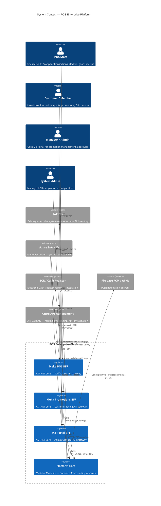
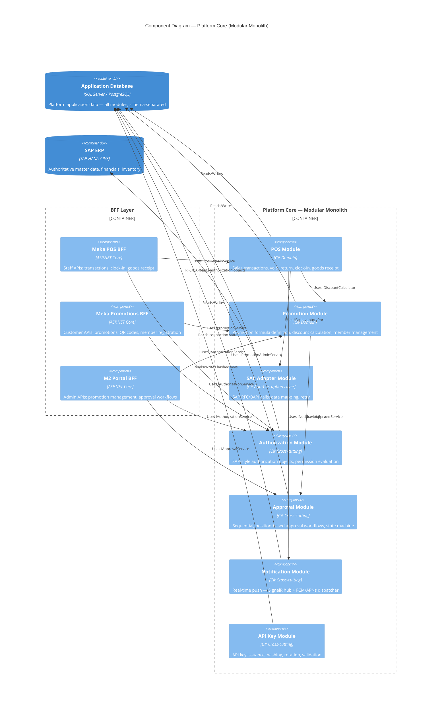
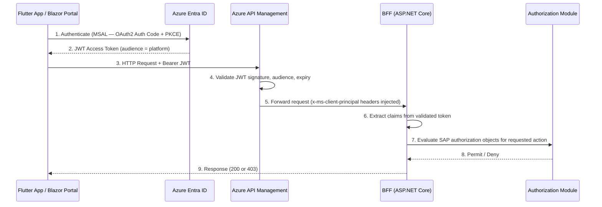
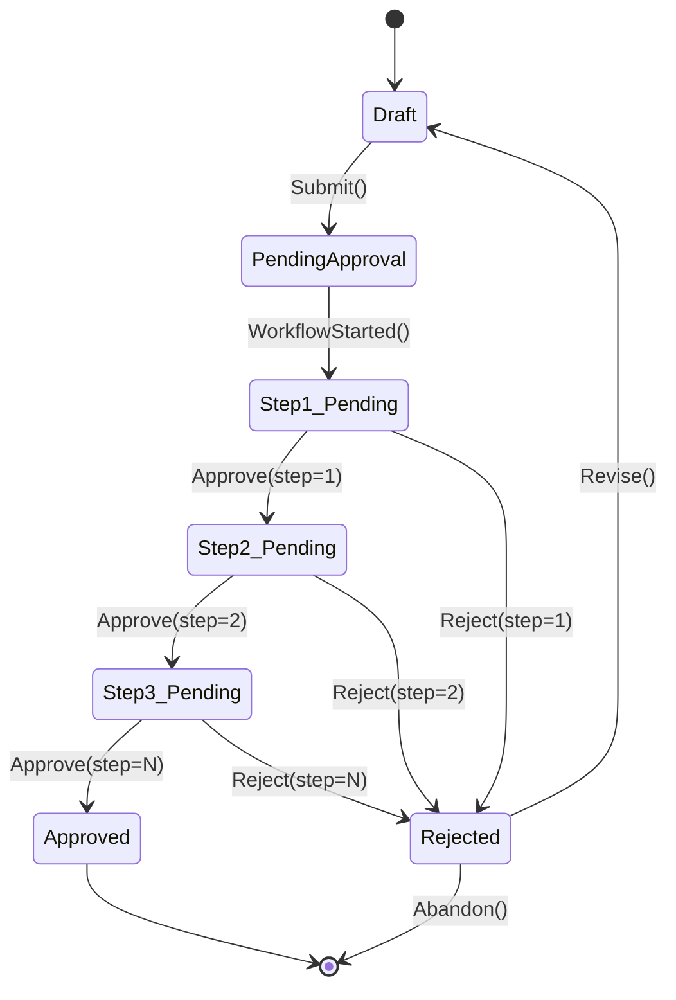

# Platform Architecture — POS & Enterprise Platform

> **Author:** Keyser (Lead / Architect)
> **Date:** 2026-05-12
> **Status:** Approved — Foundational

---

## Table of Contents

1. [Executive Summary](#1-executive-summary)
2. [ADR-001: Architecture Style Decision](#2-adr-001-architecture-style-decision)
3. [System Context Diagram](#3-system-context-diagram)
4. [Component Diagram](#4-component-diagram)
5. [BFF Pattern Design](#5-bff-pattern-design)
6. [Authentication & Authorization Architecture](#6-authentication--authorization-architecture)
7. [Container Architecture](#7-container-architecture)
8. [Cross-Cutting Services Design](#8-cross-cutting-services-design)
9. [SAP Integration Architecture](#9-sap-integration-architecture)
10. [Technology Stack Recommendation](#10-technology-stack-recommendation)
11. [Security Architecture](#11-security-architecture)

---

## 1. Executive Summary

This platform is a **greenfield enterprise layer** built on top of an existing SAP system, delivering enriched digital capabilities across multiple applications — beginning with the POS system. The chosen architecture is a **Modular Monolith with explicit bounded contexts**, deployed as a container-first application behind a BFF (Backend for Frontend) per client. Each client (Meka Promotion App, Meka POS, M2 Portal) has its own BFF to ensure interface stability and independent evolution. Cross-cutting platform services — Authorization, Approval, and Notification — are implemented as **in-process modules** (not separate microservices), sharing the same deployment unit while maintaining strict domain boundaries enforced by code structure and compilation rules. SAP integration is mediated through a dedicated Adapter module that isolates all SAP coupling behind an anti-corruption layer. This architecture is deliberately chosen for team size, delivery speed, and the risk profile of a greenfield system: it can be decomposed into microservices later if a bounded context's operational requirements diverge — but we will not pay the distributed systems tax before earning it.

---

## 2. ADR-001: Architecture Style Decision

### Status
**Accepted** — 2026-05-12 | **Final decision:** 4 processes (3 BFFs + 1 Platform API), communicate via HTTPS REST

### Context

We are building a greenfield enterprise platform that:
- Sits on top of an existing SAP ERP system
- Serves 3 front-end clients with different interaction patterns (mobile Flutter apps + Blazor portal)
- Has cross-cutting concerns: auth, approval workflows, push notifications
- Requires BFF per client (mandated)
- Must be container-capable
- Is developed by a small, focused team (≤ 10 engineers)
- Has no existing runbook, no operational expertise in distributed systems yet

### Options Evaluated

#### Option A: Microservices
**Description:** Each bounded context is an independently deployable service — Authorization Service, Approval Service, Notification Service, SAP Adapter, POS Domain Service — each with its own database, container, and API surface.

| Gain | Cost |
|------|------|
| Independent deployability per service | Distributed systems complexity from day 1 |
| Independent scaling | Service-to-service network calls, latency, retry logic |
| Technology heterogeneity if needed | Cross-service transactions require Saga/Outbox patterns |
| Clear ownership per team | Operational overhead: K8s, service mesh, distributed tracing required immediately |
| | Integration testing is significantly harder |

**Verdict for this context:** Premature. The team has not yet established domain boundaries through working software. Microservices require operational maturity that does not yet exist here. The distributed systems tax — retries, eventual consistency, distributed tracing, saga orchestration — would dominate early sprints and delay business value delivery.

#### Option B: Modular Monolith (Chosen)
**Description:** Platform Core (`M2.Platform.Api`) is an independent process; each BFF is its own independent process. Internal module boundaries within `M2.Platform.Api` are enforced by code structure. BFFs communicate with Platform.Api via **HTTPS REST with `X-Api-Key`** — not in-process. Each module owns its own data model within a shared database (schema-per-module or table-prefix separation).

| Gain | Cost |
|------|------|
| Full transactional consistency in-process | Single deployment unit — cannot scale individual modules independently |
| No distributed systems complexity | Requires discipline to maintain module boundaries in code |
| Fast local developer experience | Shared database can become a coupling point if not disciplined |
| Easy cross-cutting: DI wiring, shared middleware | A poorly written module can destabilize the whole |
| Deployable as a container — container-first, not container-only | |
| Can be split into services when operational evidence demands it | |
| Team can move fast and refactor across modules without service contracts | |

**Verdict:** This is the correct choice for this team, at this stage, for this problem. It provides the speed of a monolith with the architectural discipline of microservices — if boundaries are respected.

#### Option C: Hybrid (Modular Monolith + Selective Services)
**Description:** Core platform stays modular monolith. High-demand or high-risk components are broken out: e.g., Notification Service becomes standalone because it uses SignalR and needs persistent WebSocket connections; SAP Adapter becomes standalone because SAP calls are slow and unpredictable.

| Gain | Cost |
|------|------|
| Pragmatic decomposition where it matters | Still introduces distributed systems complexity for extracted services |
| Notification and SAP isolation benefits are real | Team must manage two operational models simultaneously |

**Verdict:** Architecturally sound, but introduces premature complexity. We accept this as the **target evolution path** — not the starting point. When evidence arrives that a module needs to be extracted (load, team ownership, failure isolation), we extract it. We will design internal interfaces now so that extraction is a rename, not a redesign.

### Decision

**We choose Option B: Modular Monolith**, with a clear internal module structure and the explicit intention to extract bounded contexts as standalone services when operational evidence demands it.

The architecture is **decomposition-ready**: every bounded context has an interface boundary, its own data namespace, and its own service registration. Extracting a module into a standalone service is an operational decision, not a redesign.

### Consequences

- Internal module boundaries **must** be enforced via C# project references (a module may not directly call another module's internal types — only its public interface)
- Each module has its own EF Core `DbContext` or `ModelBuilder` configuration — no cross-module entity navigation
- Cross-module communication is via injected interfaces, **never** direct class instantiation across boundaries
- BFF projects call `M2.Platform.Api` via typed HTTP clients (`IXxxModuleClient`) configured in `M2.Infrastructure/InterModule/` — they do not reach into domain internals. Communication is HTTPS REST with `X-Api-Key` header.
- When a module grows beyond the team's comfort: extract it into a standalone service behind the same interface — no BFF changes required
- Team must review module boundaries quarterly and make explicit decisions to keep or extract

---

## 3. System Context Diagram



---

## 4. Component Diagram



### Deployment Topology (ADR-001 Final)

The final ADR-001 decision runs as **4 independent processes**:

```
┌─────────────────┐    ┌─────────────────┐    ┌─────────────────┐
│  MekaPosBff     │    │ MekaPromosBff   │    │  M2PortalBff    │
│  (POS staff)    │    │ (member app)    │    │ (admin portal)  │
│  :5000          │    │  :5001          │    │  :5002          │
└────────┬────────┘    └────────┬────────┘    └────────┬────────┘
         │                      │                      │
         └──────────────────────┼──────────────────────┘
                                │ HTTPS REST (X-Api-Key)
                                ▼
                    ┌───────────────────────┐
                    │   M2.Platform.Api     │
                    │   (platform core)     │
                    │   :5100               │
                    │                       │
                    │  /modules/members/    │
                    │  /modules/approvals/  │
                    │  /modules/promotions/ │
                    │  /modules/sales/      │
                    │  /modules/attendance/ │
                    │  /modules/goods-...   │
                    │  /modules/reporting/  │
                    │  /modules/notifications/│
                    └──────────┬────────────┘
                               │
                               ▼
                    ┌───────────────────────┐
                    │   PostgreSQL (Azure)  │
                    └───────────────────────┘
```

### Projects

| Project | Role | Port |
|---------|------|------|
| `M2.Platform.Api` | Platform core — all domain modules, DB access | 5100 |
| `M2.MekaPosBff` | BFF for Flutter POS staff app | 5000 |
| `M2.MekaPromosBff` | BFF for Flutter member/promos app | 5001 |
| `M2.M2PortalBff` | BFF for Blazor manager/admin portal | 5002 |
| `M2.Domain` | Domain models, interfaces, DTOs | — |
| `M2.Infrastructure` | EF Core, service implementations, migrations | — |
| `M2.SharedKernel` | Base entities, Result<T>, middleware | — |
| `M2.SapConnector` | SAP OData/NCo client stubs | — |

### Communication Pattern

| Direction | Transport | Auth |
|-----------|-----------|------|
| BFF → Platform.Api | HTTPS REST | `X-Api-Key` header — validated by `ApiKeyMiddleware` on Platform.Api |
| Platform.Api → DB | EF Core / TCP | PostgreSQL connection string |
| Platform.Api → SAP | HTTPS OData / RFC-over-VPN | SAP credentials |
| Module → Module (within Platform.Api) | In-process (C# interfaces) | N/A — same process |

### Module Endpoints

All domain modules are served at `/modules/{name}/` on `M2.Platform.Api`. BFFs call these via typed
`IXxxModuleClient` HTTP clients registered in `M2.Infrastructure/InterModule/`.

`InterModuleServiceExtensions.AddInterModuleClients()` configures each typed client with:
- `BaseAddress` pointing to `Platform:BaseUrl` (defaults to `https://localhost:5100`)
- `X-Api-Key` header set from `Platform:ApiKey`

---

## 5. BFF Pattern Design

### Decision: One BFF Per Client

**We use a dedicated BFF per client.** Each front-end has fundamentally different data shapes, auth patterns, and interaction frequencies:

| Concern | Meka POS BFF | Meka Promotions BFF | M2 Portal BFF |
|---------|-------------|---------------------|---------------|
| Auth method | Entra ID (staff JWT) + API Key | API Key (public-facing) | Entra ID (manager JWT) |
| Primary user | POS staff | Customer / member | Manager / admin |
| Interaction pattern | High-frequency, transaction-heavy | Moderate, read-heavy | Low-frequency, form-heavy |
| Push notifications | Staff alerts | Promotion alerts | Approval status |
| ECR integration | Yes | No | No |

A shared BFF with routing would require all three clients to tolerate each other's breaking changes and release cadences. One BFF per client ensures each client team can evolve its API contract independently.

**Trade-off acknowledged:** Three BFFs mean three deployment units and some duplicated infrastructure code (auth middleware, logging, health checks). We mitigate this with a shared `Platform.Infrastructure` NuGet package / project that all BFFs reference.

### BFF Aggregation Pattern

```
Client Request
    → BFF validates token / API key
    → BFF composes response by calling:
        [1] Module A (IService)
        [2] Module B (IService)   ← parallel where independent
        [3] Transform + shape response for client
    → Return client-specific DTO
```

BFFs do **not** contain business logic. They orchestrate calls to domain modules and shape responses for their specific client. Business rules live in modules.

### BFF Technology

- **Framework:** ASP.NET Core 9, minimal APIs with controller grouping
- **Serialization:** `System.Text.Json` with camelCase naming policy
- **Validation:** FluentValidation on request DTOs at the BFF boundary
- **Documentation:** Scalar / OpenAPI 3.1

### API Versioning Strategy

URL-path versioning is chosen for explicit discoverability:

```
/api/v1/sales
/api/v2/sales
```

- Header and query-string versioning are rejected — they are invisible in browser/tooling and harder to route at the gateway
- **Breaking changes** require a new version prefix (`v2`)
- **Non-breaking additive changes** (new optional fields) can be shipped in-place
- Deprecated versions are supported for a minimum of **6 months** post-announcement
- API Management policies enforce version routing and deprecation headers

---

## 6. Authentication & Authorization Architecture

### Azure Entra ID — Staff & Manager Authentication Flow



### API Key Authentication — System-to-System / Public Consumers

API keys are used for:
- Meka Promotions App (public-facing — customers do not authenticate with Entra ID)
- Any future system-to-system integrations

**API Key Lifecycle:**

| Stage | Detail |
|-------|--------|
| **Issuance** | Admin generates key via M2 Portal → 256-bit CSPRNG → raw key shown ONCE |
| **Storage** | SHA-256 hash stored in `ApiKeys` table — raw key never persisted |
| **Rotation** | New key issued, old key deactivated with configurable grace period |
| **Validation** | APIM policy validates hash against `ApiKeys` table via backend call |
| **Scoping** | Each API key has an explicit scope list (e.g., `promotions:read`, `members:write`) |
| **Rate limiting** | Per-key rate limits enforced at APIM layer |
| **Transmission** | `X-Api-Key` header only — never in URL query string |

### SAP-Style Authorization Objects

SAP authorization uses the concept of **authorization objects** — each representing a business action with field-level granularity. We replicate this model on the platform:

```
Authorization Object: M_PROMOTION_MANAGE
Fields:
  ACTVT  = { 01=Create, 02=Change, 03=Display, 06=Delete }
  MSTAE  = { promotion status scope }
```

**Mapping to Platform:**

```csharp
// Each permission check is expressed as an authorization object evaluation
await _authorizationService.CheckAsync(
    user: principal,
    authObject: "M_PROMOTION_MANAGE",
    fields: new { ACTVT = "02", MSTAE = "ACTIVE" }
);
// Throws UnauthorizedException or returns AuthorizationResult
```

**Data Model:**

```
AuthorizationRole
  → RoleAuthorizationObject (many)
      → AuthorizationObjectFieldValue (many)
UserRoleAssignment
  → User
  → AuthorizationRole
  → ValidFrom / ValidTo (time-bounded)
```

### Where Auth/Authz Enforcement Lives

| Layer | Responsibility |
|-------|---------------|
| **Azure API Management** | JWT signature validation, API key format validation, rate limiting |
| **BFF Middleware** | Token extraction, claim normalization, user context building |
| **Authorization Module** | Business-level permission evaluation (auth objects) |
| **Domain Modules** | Domain-specific guards (e.g., cannot void a transaction you didn't create) |

No authorization logic in the database layer.

---

## 7. Container Architecture

### Container Strategy Per Component

| Component | Container | Notes |
|-----------|-----------|-------|
| Meka POS BFF | `pos/meka-pos-bff` | ASP.NET Core, port 5000 |
| Meka Promotions BFF | `pos/meka-promos-bff` | ASP.NET Core, port 5001 |
| M2 Portal BFF | `pos/m2-portal-bff` | ASP.NET Core, port 5002 |
| Platform Core (`M2.Platform.Api`) | `pos/m2-platform-api` | ASP.NET Core, port 5100 — independent process; all domain modules |
| Database | `mcr.microsoft.com/mssql/server` or PostgreSQL | Vol-mounted in dev |
| SAP Adapter | Part of Platform Core container | Isolated by module boundary |
| SignalR Notification Hub | Sidecar or co-located with BFF | See §8 |

**Base Image:** `mcr.microsoft.com/dotnet/aspnet:9.0-alpine` for runtime; `mcr.microsoft.com/dotnet/sdk:9.0` for build stage.

All images are multi-stage builds. Final images contain no SDK tooling.

### Docker Compose — Local Development

```yaml
# docker-compose.yml (abbreviated — see full file in /docker/)
version: "3.9"

services:
  meka-pos-bff:
    build:
      context: .
      dockerfile: src/MekaPosBff/Dockerfile
    ports: ["5000:8080"]
    environment:
      - ASPNETCORE_ENVIRONMENT=Development
      - Platform__BaseUrl=https://platform-api:8080
      - Platform__ApiKey=${PLATFORM_API_KEY}
      - Entra__TenantId=${ENTRA_TENANT_ID}
      - Entra__ClientId=${ENTRA_CLIENT_ID}
    depends_on: [platform-api]
    healthcheck:
      test: ["CMD", "curl", "-f", "http://localhost:8080/health"]
      interval: 10s
      timeout: 5s
      retries: 3

  meka-promos-bff:
    build:
      context: .
      dockerfile: src/MekaPromosBff/Dockerfile
    ports: ["5001:8080"]
    environment:
      - Platform__BaseUrl=https://platform-api:8080
      - Platform__ApiKey=${PLATFORM_API_KEY}
    depends_on: [platform-api]

  m2-portal-bff:
    build:
      context: .
      dockerfile: src/M2PortalBff/Dockerfile
    ports: ["5002:8080"]
    environment:
      - Platform__BaseUrl=https://platform-api:8080
      - Platform__ApiKey=${PLATFORM_API_KEY}
    depends_on: [platform-api]

  platform-api:
    build:
      context: .
      dockerfile: src/Platform.Api/Dockerfile
    ports: ["5100:8080"]
    environment:
      - ASPNETCORE_ENVIRONMENT=Development
      - ConnectionStrings__AppDb=${DB_CONNECTION_STRING}
      - Platform__ApiKey=${PLATFORM_API_KEY}
    depends_on: [db]
    healthcheck:
      test: ["CMD", "curl", "-f", "http://localhost:8080/health"]
      interval: 10s
      timeout: 5s
      retries: 3

  db:
    image: mcr.microsoft.com/mssql/server:2022-latest
    environment:
      - ACCEPT_EULA=Y
      - SA_PASSWORD=${DB_SA_PASSWORD}
    ports: ["1433:1433"]
    volumes:
      - db_data:/var/opt/mssql

volumes:
  db_data:
```

### Production Deployment Target

**Recommendation: Azure Container Apps (ACA)**

| Option | Trade-off |
|--------|-----------|
| **Azure Container Apps** ✅ | Managed Kubernetes under the hood. Scale-to-zero, built-in Dapr support, KEDA autoscaling. No K8s expertise required. Native HTTPS ingress with cert management. Best fit for this team's operational maturity. |
| AKS | Full Kubernetes control — requires cluster ops, node pool management, cert-manager, ingress controller. Justified if the platform grows to 20+ services or requires exotic networking. Overkill now. |
| Azure App Service (Containers) | Simpler than ACA but no scale-to-zero, no sidecar support, limited traffic splitting. Not recommended — dead end for growth. |

**ACA Configuration per Container App:**
- Min replicas: 1 (production), 0 (staging)
- Max replicas: 10 (scale on HTTP queue depth via KEDA)
- CPU: 0.5 vCPU / Memory: 1Gi (starting point, tune per load test)
- Ingress: External (BFFs) / Internal (Platform Core if extracted)
- Managed Identity for Key Vault access (no secrets in env vars in production)

### Health Checks

All ASP.NET Core services expose:
```
GET /health         → liveness (is the process alive?)
GET /health/ready   → readiness (is the service ready to serve traffic? DB connected?)
GET /health/live    → startup probe
```

Implemented via `Microsoft.Extensions.Diagnostics.HealthChecks` with database connectivity checks included.

### Environment Configuration Approach

| Environment | Config Source |
|-------------|--------------|
| Local dev | `appsettings.Development.json` + `.env` file (gitignored) |
| CI/CD | GitHub Actions secrets → environment variables |
| Staging/Production | Azure Key Vault (accessed via Managed Identity) + ACA environment variables |

**Rule:** No secrets in code, no secrets in Docker images. All sensitive config arrives at runtime via Key Vault references or injected environment variables.

---

## 8. Cross-Cutting Services Design

### 8.1 Authorization Service

**Decision: Shared Library Module (in-process)**

Rationale: Authorization checks are on the hot path of every request. Network-crossing for each check would add latency and failure surface. Authorization data is read-heavy and can be cached aggressively in-process.

**Design:**
```
Platform.Authorization (C# project)
  ├── IAuthorizationService          ← public interface consumed by BFFs and modules
  ├── AuthorizationService           ← implementation
  ├── AuthorizationObject            ← domain model
  ├── AuthorizationCache             ← IMemoryCache wrapper — user role data cached 5 min
  └── AuthorizationDbContext         ← schema: authz.*
```

Cache invalidation: when a user's role assignment changes, the Authorization Module publishes an in-process `RoleAssignmentChangedEvent` via MediatR; the cache entry is evicted.

**Evolution path:** If authorization data grows complex (ABAC, dynamic policies), extract to a standalone Policy Decision Point (PDP) service with a local cache for low-latency. Today it doesn't warrant it.

### 8.2 Approval Service — State Machine Design

**Decision: In-process module with explicit state machine**

The approval workflow is **sequential and position-based**: each approval step must be completed by a user holding a specific organizational position before the next step activates.

**State Machine:**



**Data Model:**

```
ApprovalWorkflow
  Id, EntityType, EntityId, Status, CreatedAt

ApprovalStep
  Id, WorkflowId, StepOrder, RequiredPositionCode, Status
  ApproverId (nullable), ApprovedAt (nullable), RejectedAt (nullable), Comment

ApprovalWorkflowTemplate
  Id, EntityType, Steps[]   ← defines step order and required positions per entity type
```

**Notifications:** On step completion, the Notification Module is triggered to push real-time status to the submitter and next approver.

### 8.3 Notification Service — Push Delivery

**Decision: SignalR for real-time web/Blazor + Firebase FCM for mobile**

| Channel | Technology | Use Case |
|---------|-----------|----------|
| Blazor M2 Portal | ASP.NET Core SignalR | Real-time approval updates, admin alerts |
| Flutter Mobile Apps | Firebase Cloud Messaging (FCM) + APNs (iOS) | Promotion push notifications, POS alerts |

**Architecture:**

```
NotificationModule
  ├── INotificationService          ← public interface
  ├── SignalRNotificationChannel    ← uses IHubContext<PlatformHub>
  ├── FcmNotificationChannel        ← uses Firebase Admin SDK
  ├── NotificationDispatcher        ← routes to correct channel by recipient type
  └── DeviceTokenRegistry           ← stores user ↔ FCM device token mapping
```

The BFF hosts the SignalR Hub. Flutter apps register FCM tokens on login; the registry maps `UserId → FCMToken[]` to support multi-device.

**Trade-off acknowledged:** Azure Notification Hubs was evaluated. It adds managed fan-out for large audiences but introduces additional Azure dependency and cost. For this system's scale (staff + managers), direct FCM is sufficient and simpler. Revisit if the promotions app grows to 100k+ concurrent users.

---

## 9. SAP Integration Architecture

### Integration Pattern Decision

**Chosen: SAP REST OData APIs (primary) + NCo RFC/BAPI (fallback)**

| Option | Trade-off |
|--------|-----------|
| **SAP REST OData** ✅ | Standard HTTP — works with standard .NET HttpClient. SAP S/4HANA exposes OData APIs for most standard business objects. Observable, testable, mockable. |
| RFC/BAPI via SAP NCo | Native, low-level, high-performance for complex batch operations. Requires SAP NCo library (proprietary, Windows-only in some versions). Use only where OData does not expose the needed function. |
| Message Queue (MQ/Service Bus) | Decoupled, resilient for async workflows. Justified for high-volume batch integration (e.g., nightly inventory sync). Not justified for real-time POS transaction flows. |

**Rule:** Use OData first. Fall back to RFC/BAPI only where OData is unavailable or inadequate. Never call SAP directly from domain modules — all calls go through the SAP Adapter.

### SAP Adapter Design (Anti-Corruption Layer)

```
Platform.SapAdapter (C# project)
  ├── ISapInventoryPort              ← port interface (defined in domain)
  ├── ISapPricingPort
  ├── ISapGoodsReceiptPort
  ├── SapODataClient                 ← typed HttpClient for OData calls
  ├── SapNCoClient                   ← RFC/BAPI client (conditional compile / optional)
  ├── SapDataMapper                  ← SAP ↔ platform domain model translation
  └── SapAdapterHealthCheck          ← reports SAP connectivity to /health/ready
```

The SAP Adapter translates SAP's data model into platform domain concepts. Domain modules never see SAP types — they see platform types. This is the anti-corruption layer.

### Error Handling & Retry Strategy

| Failure Type | Strategy |
|-------------|----------|
| Transient network error | Polly retry with exponential backoff — 3 attempts, 2s / 4s / 8s |
| SAP system busy / lock | Retry with jitter — up to 5 attempts |
| SAP functional error (BAPI_RETURN error) | Map to domain exception, no retry — surface to caller |
| SAP unavailable (circuit open) | Polly circuit breaker — open after 5 failures in 30s, half-open after 60s |
| Timeout | HttpClient timeout = 30s (configurable). POS transactions fail fast on timeout |

**Outbox Pattern for critical writes:** Goods receipt confirmations and sales transaction sync to SAP use an outbox pattern — write to platform DB first (transactional), then a background worker retries SAP sync until acknowledged. Prevents data loss on SAP downtime.

---

## 10. Technology Stack Recommendation

### Backend

| Layer | Technology | Version | Rationale |
|-------|-----------|---------|-----------|
| Language | C# | 13 | Latest stable, pattern matching, primary constructors, collection expressions |
| Runtime | .NET | 9.0 LTS | Long-term support, performance gains, native AOT optional |
| Web Framework | ASP.NET Core | 9.0 | Minimal APIs + Controllers, best-in-class performance |
| ORM | Entity Framework Core | 9.x | Code-first, migrations, LINQ — appropriate for domain-driven schema |
| Validation | FluentValidation | 11.x | Expressive, testable, integrates with ASP.NET pipeline |
| Mapping | Mapperly | latest | Source-generated, zero-reflection mapping — fast, type-safe |
| Mediator | MediatR | 12.x | CQRS + in-process events — clean cross-module communication |
| Resiliency | Polly | 8.x | Retry, circuit breaker, timeout policies |
| HTTP Client | Refit | 7.x | Typed REST client generation (for SAP OData calls) |
| Auth | Microsoft.Identity.Web | 3.x | Entra ID JWT validation, MSAL integration |
| Logging | Serilog | 4.x | Structured logging, sinks to Azure Monitor / Application Insights |
| Observability | OpenTelemetry .NET | 1.x | Traces, metrics, logs — vendor-neutral |
| Health Checks | AspNetCore.HealthChecks.* | latest | DB, SAP, downstream dependency checks |
| Background Jobs | Hangfire | 1.8.x | SAP outbox worker, scheduled jobs — persistent job queue |
| Real-time | ASP.NET Core SignalR | 9.0 | Blazor push notifications |
| Push (mobile) | Firebase Admin SDK | latest | FCM dispatch for Flutter apps |
| Testing | xUnit + Moq + FluentAssertions | latest | Standard .NET testing trio |

### Database

**Recommendation: PostgreSQL 16** (primary consideration), with SQL Server as acceptable alternative if organization mandates it.

| Criterion | PostgreSQL | SQL Server |
|-----------|-----------|------------|
| Cost | Open source — no licensing | Per-core licensing — significant cost at scale |
| Azure hosting | Azure Database for PostgreSQL Flexible Server | Azure SQL Database |
| EF Core support | Excellent (Npgsql) | Excellent (Microsoft) |
| JSON support | JSONB — superior | JSON (limited indexing) |
| Container dev | Standard `postgres:16` image | Microsoft image (larger) |
| Enterprise familiarity | May need DBA enablement | Familiar to enterprise teams |

**Decision contingency:** If the organization has existing SQL Server licensing or a DBA team specialized in MSSQL, SQL Server 2022 is an equivalent technical choice. The code is database-agnostic via EF Core. Make this call based on org constraints, not technical preference.

### Message Broker

**Not required in Phase 1.** The outbox pattern with Hangfire handles async SAP sync without a broker. 

**Evolution trigger:** If the notification fan-out exceeds ~10k concurrent connections, or if event-driven integration between future applications is required, adopt **Azure Service Bus** (Standard tier for topics/subscriptions). Do not introduce a broker speculatively.

### API Gateway

**Azure API Management (APIM) — Consumption tier** for development; **Standard v2** for production.

- JWT validation policies for Entra ID tokens
- API key validation via backend lookup policy
- Rate limiting per key and per IP
- Subscription-based routing
- OpenAPI import from BFF Swagger endpoints

### Logging & Observability Stack

| Tool | Role |
|------|------|
| Serilog | Structured log emission (all services) |
| Azure Application Insights | Telemetry sink — logs, traces, metrics |
| OpenTelemetry | Distributed trace propagation (W3C TraceContext) |
| Azure Monitor | Dashboards, alerting |
| Scalar / Swagger UI | API documentation (dev environment) |

---

## 11. Security Architecture

### Network Topology

```
Internet
  │
  ▼
Azure API Management (public endpoint)
  │  ← validates auth, rate limits, blocks bad traffic
  ▼
Azure Container Apps Environment (internal VNet)
  ├── Meka POS BFF          (internal ingress only — APIM is the public face)
  ├── Meka Promotions BFF   (internal ingress)
  └── M2 Portal BFF         (internal ingress)
        │
        ▼
    M2.Platform.Api :5100  (HTTPS REST — BFFs authenticate via X-Api-Key)
        │
        ▼
    SAP via private network / ExpressRoute / VPN
    PostgreSQL via private endpoint
```

**No BFF is directly internet-exposed.** All traffic enters through APIM. This provides a single enforcement point for auth, rate limiting, and WAF (if Azure APIM + Azure Front Door WAF is applied).

### Secret Management

| Secret Type | Storage | Access Pattern |
|------------|---------|----------------|
| DB connection strings | Azure Key Vault | ACA Managed Identity → Key Vault reference |
| Entra ID app secrets | Azure Key Vault | ACA Managed Identity |
| SAP credentials | Azure Key Vault | ACA Managed Identity |
| FCM service account key | Azure Key Vault | ACA Managed Identity |
| API key hashes | Application DB | Never in config — always computed |
| Local dev secrets | `.env` (gitignored) + `dotnet user-secrets` | Never committed |

**Rule:** If a secret is in source control, treat it as compromised and rotate immediately.

### Data Protection

| Layer | Mechanism |
|-------|----------|
| In transit | TLS 1.2+ enforced at APIM; internal ACA traffic TLS-enforced |
| At rest | Azure Database encryption at rest (AES-256, platform-managed keys) |
| API key storage | SHA-256 hash — raw key never stored |
| PII (customer phone numbers) | Encrypted at column level using ASP.NET Core Data Protection API |
| Audit logging | All data mutations log actor + timestamp — immutable audit trail |

### OWASP Top 10 Controls

| Threat | Control |
|--------|---------|
| Broken Access Control | Authorization Module enforces auth objects on every request; no role checks in UI only |
| Cryptographic Failures | TLS everywhere; no MD5/SHA1; Key Vault for all secrets |
| Injection | EF Core parameterized queries; no raw SQL string concatenation |
| Insecure Design | Auth enforced at infrastructure level (APIM + BFF middleware), not just in controllers |
| Security Misconfiguration | Environment-specific config; APIM policy enforcement; container images do not run as root |
| Vulnerable Components | Dependabot alerts enabled; regular `dotnet list package --vulnerable` in CI |
| Auth Failures | JWT validated at APIM + BFF; short-lived tokens (1h); refresh token rotation |
| Integrity Failures | Container image signing (Azure Container Registry + Notation); dependency pinning |
| Logging Failures | All auth events, authorization decisions, and exceptions logged via Serilog + App Insights |
| SSRF | Outbound calls only to known SAP endpoints and FCM — no user-controlled URLs |
