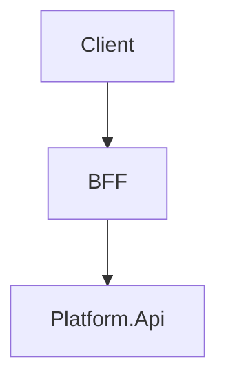

# Documentation Standards — m2 Monorepo

> **Status:** Approved
> **Owner:** Keyser (Lead / Architect)
> **Last Reviewed:** 2026-05-15
> **Change Log:**
> - 2026-05-15 — Initial framework created (Keyser)

---

## Purpose

This document is the master index for all documentation in the `m2` monorepo. It defines *where* docs live, *what format* each type uses, and *how* they stay current. Read this before writing or updating any doc.

**Principle:** Docs are a tool, not a ceremony. Every doc must earn its place by reducing ambiguity or onboarding friction.

---

## Folder Structure

```
docs/
  standards/
    README.md          ← This file — master index and meta-standard
    frontend.md        ← Flutter/Blazor UI standards (Owner: Fenster)
    database.md        ← PostgreSQL schema and migration standards (Owner: Edie)
    api.md             ← REST API design and versioning standards (Owner: McManus)
    CODING-STANDARDS.md ← Language-level coding standards (Owner: Keyser)
  adr/
    README.md          ← ADR index and usage guide (Owner: Keyser)
    template.md        ← ADR template
    ADR-NNN-slug.md    ← Individual ADRs (numbered sequentially)
  architecture/
    ARCHITECTURE.md    ← System architecture overview (Owner: Keyser)
  data/
    DATA-DESIGN.md     ← Data model and domain entities (Owner: Edie)
  developer-guide/
    DEV-SETUP.md       ← Local dev environment setup (Owner: McManus)
  testing/
    TEST-STRATEGY.md   ← Test approach, scope, and tools (Owner: Verbal)
  sprints/
    sprint-plan.md     ← Sprint backlog and velocity tracking (Owner: Keyser)
  backlog/
    FRONTEND-BACKLOG.md  ← Frontend feature backlog (Owner: Fenster)
    BACKEND-BACKLOG.md   ← Backend feature backlog (Owner: McManus)
```

**Rule:** All documentation lives under `docs/`. Do not scatter docs in app subdirectories unless they are co-located code comments (e.g., `README.md` at package level for public API surface only).

---

## Common Doc Elements

Every document in `docs/` must include these fields in its header:

```markdown
> **Status:** Draft | Review | Approved | Deprecated
> **Owner:** <Agent or team member name and role>
> **Last Reviewed:** YYYY-MM-DD
> **Change Log:**
> - YYYY-MM-DD — Description of change (Author)
```

### Status Definitions

| Status | Meaning |
|--------|---------|
| **Draft** | Being actively written; do not rely on this doc for implementation |
| **Review** | Complete enough to read; feedback requested before approval |
| **Approved** | Authoritative; team is expected to follow this |
| **Deprecated** | Superseded by another doc or decision; kept for historical reference only |

---

## Domain-Specific Standards Docs

| File | Domain | Owner | Status |
|------|--------|-------|--------|
| [`frontend.md`](./frontend.md) | Flutter (Riverpod, widgets, navigation) and Blazor (code-behind, components) | Fenster | Draft |
| [`database.md`](./database.md) | PostgreSQL schema, EF Core migrations, naming, soft delete | Edie | Draft |
| [`api.md`](./api.md) | REST endpoint design, versioning, error responses, OpenAPI | McManus | Draft |
| [`CODING-STANDARDS.md`](./CODING-STANDARDS.md) | C#, Dart, naming, file structure, Git workflow | Keyser | Approved |

---

## Diagram Standards

Use **Mermaid** for all diagrams embedded in Markdown. Mermaid renders natively in GitHub and most Markdown previews.

```markdown

```

**Diagram types by use case:**

| Use Case | Mermaid Diagram Type |
|----------|----------------------|
| Component/system relationships | `graph TD` or `graph LR` |
| Sequence / flow between services | `sequenceDiagram` |
| Database entity relationships | `erDiagram` |
| State machines (approval, order status) | `stateDiagram-v2` |
| High-level architecture overview | `graph TD` with subgraphs |

For diagrams that require richer tooling (e.g., formal C4 model), export as PNG/SVG and store under `docs/architecture/assets/`. Always include the source file alongside the export.

---

## Review Cadence

| Doc Type | Review Frequency | Trigger |
|----------|-----------------|---------|
| Architecture (`ARCHITECTURE.md`) | Per sprint | Any structural change to Platform.Api or BFFs |
| Coding standards (`CODING-STANDARDS.md`) | Quarterly | New language/framework version or team retrospective finding |
| Domain standards (`frontend.md`, `database.md`, `api.md`) | Per sprint | Any breaking pattern change in the respective domain |
| ADRs (`docs/adr/`) | Immutable after approval | New ADR supersedes old; old is marked Deprecated |
| Sprint plan | Each sprint | Mandatory before sprint kickoff |
| Developer guide (`DEV-SETUP.md`) | On infra change | New required tool, port change, or env variable added |

**Stale doc rule:** If a doc has not been reviewed in 90 days and the project is active, the owner must either confirm it is still accurate or update it. A stale doc is worse than no doc.

---

## Ownership and Accountability

| Owner | Docs They Own |
|-------|--------------|
| **Keyser** | `standards/README.md`, `standards/CODING-STANDARDS.md`, `architecture/ARCHITECTURE.md`, `adr/` |
| **Fenster** | `standards/frontend.md`, `backlog/FRONTEND-BACKLOG.md` |
| **Edie** | `standards/database.md`, `data/DATA-DESIGN.md` |
| **McManus** | `standards/api.md`, `developer-guide/DEV-SETUP.md`, `backlog/BACKEND-BACKLOG.md` |
| **Verbal** | `testing/TEST-STRATEGY.md` |

Ownership means: you are accountable for keeping it current, not that you wrote every word.

---

## Writing a New Standards Doc

1. Copy the header template (Status/Owner/Last Reviewed/Change Log) into the new file.
2. Set Status to **Draft**.
3. Open a PR; the owner of this `README.md` (Keyser) must approve.
4. After team review, set Status to **Approved**.
5. Add the doc to the table in this README.

Do not create new top-level folders under `docs/` without an ADR or discussion — premature folder sprawl is a real cost.

---

## Related

- [ADR Index → `docs/adr/README.md`](../adr/README.md)
- [Architecture Overview → `docs/architecture/ARCHITECTURE.md`](../architecture/ARCHITECTURE.md)
- [Coding Standards → `docs/standards/CODING-STANDARDS.md`](./CODING-STANDARDS.md)
