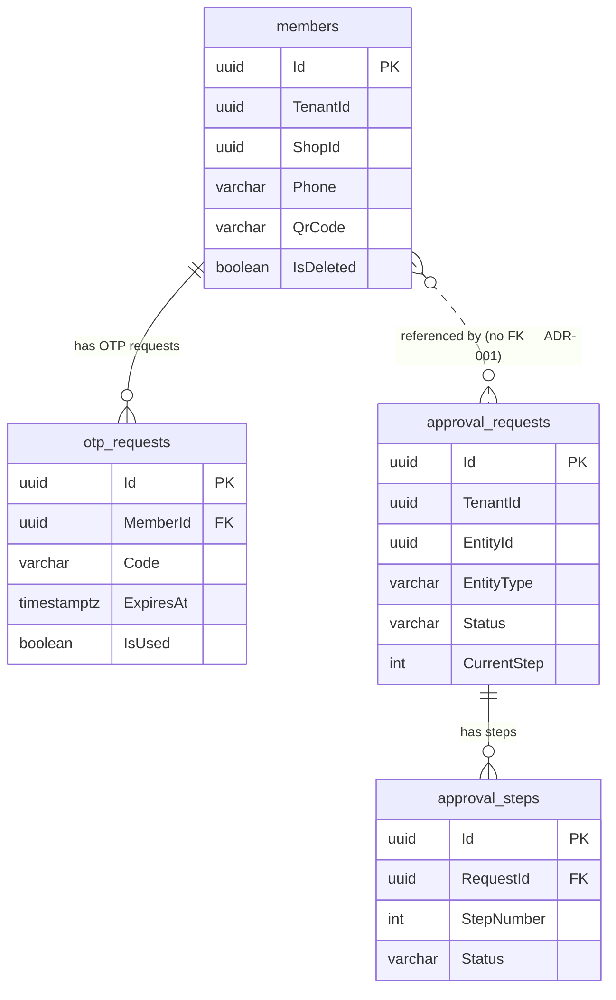

# Database Design Documentation Standard

> **Author:** Edie (Database Specialist)
> **Date:** 2026-05-15
> **Status:** Approved — Mandatory for all database contributors

---

## Table of Contents

1. [Table / Entity Documentation](#1-table--entity-documentation)
2. [Entity Relationship Diagrams (ERD)](#2-entity-relationship-diagrams-erd)
3. [Migration Documentation](#3-migration-documentation)
4. [Query Documentation](#4-query-documentation)
5. [Demo / Seed Data](#5-demo--seed-data)
6. [Templates](#6-templates)

---

## 1. Table / Entity Documentation

Every table introduced or modified must be documented in `docs/data/DATA-DESIGN.md` under the sprint section in which it was created. Documentation lives alongside the code — not after it.

### 1.1 Required Fields per Table

| Field | Required | Description |
|-------|----------|-------------|
| **Purpose** | Yes | One or two sentences: what this table stores and why it exists. |
| **Owner domain** | Yes | Which bounded context owns this table (e.g., Sales, Members, Approvals). |
| **Sprint introduced** | Yes | Sprint number and migration name that created the table. |
| **Columns** | Yes | See §1.2. |
| **Indexes** | Yes | All indexes including the implied PK index. |
| **Constraints** | Yes | Unique constraints, check constraints. |
| **Foreign keys** | Yes | See §1.3. |
| **Soft delete** | Yes | Whether soft delete applies; see §1.4. |

### 1.2 Column Documentation Format

Document columns as a markdown table with these exact headers:

| Column | Type | Nullable | Default | Description |
|--------|------|----------|---------|-------------|

- **Column:** exact column name as it appears in the database (e.g., `TenantId`, `CreatedAt`)
- **Type:** PostgreSQL data type (e.g., `uuid`, `varchar(100)`, `numeric(18,2)`, `timestamptz`, `boolean`, `text`)
- **Nullable:** `NOT NULL` or `NULL`
- **Default:** Explicit default value, or `—` if none
- **Description:** What the value represents; include enums inline (e.g., `Enum: Pending/Active/Expired`)

Standard audit columns (`CreatedAt`, `CreatedBy`, `UpdatedAt`, `UpdatedBy`, `IsDeleted`, `DeletedAt`, `DeletedBy`) may be abbreviated as `+ audit/soft-delete columns — Standard BaseEntity columns` when they repeat verbatim across tables. Document them in full on their first occurrence.

### 1.3 Foreign Key Relationships

For each FK, document:

```
{ColumnName} → {table}.{column}   [{ON DELETE behaviour}]
```

Examples:
```
GoodsReceiptNoteId → goods_receipt_notes.Id   [CASCADE DELETE]
NotificationTemplateId → notification_templates.Id   [RESTRICT DELETE]
MemberId → (no DB constraint — cross-module ref, ADR-001)
```

Cross-module references that intentionally carry no DB-level FK constraint **must** note `(no DB constraint — cross-module ref, ADR-001)`. Do not leave them undocumented.

### 1.4 Soft Delete Convention

All tables that extend `BaseEntity` use soft delete. The pattern is:

| Column | Type | Notes |
|--------|------|-------|
| `IsDeleted` | `boolean NOT NULL` | Default `false`. Set to `true` on logical delete. |
| `DeletedAt` | `timestamptz NULL` | Timestamp of deletion. `NULL` when not deleted. |
| `DeletedBy` | `varchar(256) NULL` | Identity of actor who deleted. `NULL` when not deleted. |

**Rules:**
- Application code must filter `WHERE IsDeleted = false` on all queries unless explicitly querying deleted records.
- Hard delete is not permitted on BaseEntity tables. If a record must be physically removed, raise it as a schema decision.
- Lightweight entities (`OtpRequest`, `NotificationLog`) that extend no base class do not carry soft delete — document this explicitly: `No soft delete — append-only / audit log table`.

---

## 2. Entity Relationship Diagrams (ERD)

### 2.1 When an ERD is Required

| Situation | ERD Required? |
|-----------|--------------|
| New domain introduced (≥ 3 tables) | **Yes — required** |
| Single new table added to existing domain | Optional — use judgment |
| Cross-domain relationship documented | **Yes — required** |
| Migration adds a column to an existing table | No |

### 2.2 Preferred Tooling

**Mermaid inline in markdown** is the standard. Reasons: version-control-friendly, renders in GitHub, no external tool dependency, diffs are human-readable.

Do not use image exports (`.png`, `.svg`) as the primary ERD source. If a visual export is needed for a presentation, generate it from the Mermaid source and note it as a derived artifact.

### 2.3 Mermaid ERD Syntax

Use `erDiagram` blocks. Key syntax rules for this project:

- Cardinality: `||--o{` (one-to-many, FK side is `o{`), `||--||` (one-to-one), `}o--o{` (many-to-many)
- Only show columns that carry semantic weight (PK, FKs, status, key business fields). Do not list every audit column.
- Cross-module references that lack a DB FK should use `..` (dashed line) with a comment.

**Example:**



---

## 3. Migration Documentation

### 3.1 Migration File Naming

EF Core generates migration files. Use PascalCase descriptions that are meaningful without context:

```
# Format: {timestamp}_{SprintOrFeature}_{Description}
20260512010000_Sprint2_MembersApprovalsNotifications
20260512020000_Sprint3_PromotionsSalesAttendance
20260513125005_Sprint4_AuthSchema
```

**Rules:**
- One logical change per migration. Do not bundle unrelated schema changes.
- Migration is committed in the **same PR** as the code that requires it.
- Never edit a migration after it has been applied to any environment. Write a new corrective migration instead.

### 3.2 Documenting Each Migration

Each sprint section in `DATA-DESIGN.md` must open with a migration header:

```markdown
## Sprint N Tables — {DomainA}, {DomainB}

Migration: `{timestamp}_{Name}`
```

For non-sprint (hotfix or additive) migrations, add an entry in `DATA-DESIGN.md` under a `## Hotfix Migrations` section:

```markdown
### {timestamp}_{Name}

- **What changed:** [one sentence]
- **Why:** [business or technical reason]
- **Rollback plan:** [Down() drops the column/table; or: Down() not safe — requires data export before running]
- **Tables affected:** [list]
```

### 3.3 Rollback Plan

The `Down()` method in every EF Core migration must be implemented. Document in the migration header comment when `Down()` is unsafe (i.e., data would be lost):

```csharp
/// <summary>
/// Sprint 4 — Auth schema.
/// Down() drops all four auth tables. Safe only if no auth data has been written.
/// </summary>
```

Drop order in `Down()` must respect FK dependencies — drop dependent tables before principals.

---

## 4. Query Documentation

### 4.1 When a Query Deserves Documentation

Document a query when any of the following apply:

- It spans more than two tables (JOIN complexity)
- It uses a subquery, CTE, or window function
- It has specific index requirements that are non-obvious
- It is called on a hot path (e.g., every POS transaction, every page load)
- Its result shape differs from a single entity (projection, aggregate)

Simple CRUD queries (single-table select by PK or FK) do not require documentation.

### 4.2 Query Documentation Format

Place query documentation as an XML doc comment on the repository method or CQRS query handler, **and** include a summary in `DATA-DESIGN.md` under the relevant domain section when the query is complex or performance-critical.

**Format:**

```markdown
### Query: {ShortName}

| Field | Value |
|-------|-------|
| **Purpose** | What this query computes or retrieves |
| **Caller** | Handler / service class that owns this query |
| **Parameters** | `tenantId: uuid`, `shopId: uuid`, `status: varchar` |
| **Result set** | Description of returned shape (columns or DTO name) |
| **Indexes used** | `IX_sales_transactions_TenantId_ShopId_Status`, `IX_sales_line_items_TransactionId` |
| **Performance notes** | Expected row count, any pagination requirement, known slow paths |
```

**Example:**

```markdown
### Query: ActiveSalesSummaryByShop

| Field | Value |
|-------|-------|
| **Purpose** | Returns daily sales totals and line item counts per shop for the dashboard summary widget. |
| **Caller** | `GetSalesSummaryQueryHandler` |
| **Parameters** | `tenantId: uuid`, `shopId: uuid`, `date: date` |
| **Result set** | `(TotalAmount: decimal, TransactionCount: int, LineItemCount: int)` |
| **Indexes used** | `IX_sales_transactions_TenantId_ShopId_Status`, `IX_sales_line_items_TransactionId` |
| **Performance notes** | Bounded to single day + single shop. Expected < 500 transactions/day. No pagination required at current scale. |
```

---

## 5. Demo / Seed Data

### 5.1 Where Seed Data Lives

All development seed data lives in `src/M2.Infrastructure/Seed/DevSeedService.cs`. This service:
- Implements `IHostedService`
- Runs only in the `Development` environment
- Is **idempotent** — checks `AnyAsync` before inserting. Running it twice must produce no duplicate rows.

### 5.2 Documenting Seed Data

Document all seeded tables in `DATA-DESIGN.md` under a `## Seed / Demo Data` section. Format:

```markdown
## Seed / Demo Data

> All seed data is inserted by `DevSeedService` (Development environment only).
> TenantId: `WellKnownTenants.Default` (`00000000-0000-0000-0000-000000000001`)
> ShopId: `00000000-0000-0000-0000-000000000010`

| Table | Seeded Rows | Notes |
|-------|-------------|-------|
| `members` | 5 | Demo members with varied names and membership tiers |
| `promotions` | 3 | All `Active` status; cover PercentDiscount, FixedDiscount, BuyXGetY |
| `approval_policies` | 2 | Promotion + GoodsReceipt entity types |
```

### 5.3 Rules for Seed Data

- Seed data must never be written to non-Development environments. The `IsDevelopment()` guard is mandatory.
- Seed data must use `WellKnownTenants.Default` as `TenantId` and the documented fixed `ShopId`.
- Any change to seeded rows must be reflected in `DATA-DESIGN.md`.
- Do not seed passwords, tokens, or personally identifiable data — use placeholder values only.

---

## 6. Templates

### 6.1 New Table Documentation Template

Copy this block into `DATA-DESIGN.md` when documenting a new table.

```markdown
### {table_name}

**Purpose:** {One sentence explaining what this table stores and why it exists.}
**Domain:** {DomainName}
**Sprint introduced:** Sprint N — migration `{timestamp}_{MigrationName}`

| Column | Type | Nullable | Default | Description |
|--------|------|----------|---------|-------------|
| Id | uuid | NOT NULL | — | Client-assigned GUID primary key |
| TenantId | uuid | NOT NULL | — | Multi-tenancy discriminator |
| ShopId | uuid | NOT NULL | — | Multi-store discriminator |
| {ColumnName} | {type} | {NOT NULL\|NULL} | {default\|—} | {description} |
| + audit/soft-delete columns | | | | Standard BaseEntity columns |

**Indexes:**
- `PK_{table_name}` on `Id`
- `IX_{table_name}_{Column(s)}` on `({Column(s)})` — {reason}
- `UX_{table_name}_{Column(s)}` on `({Column(s)})` — unique constraint, {reason}

**Foreign keys:**
- `{ColumnName}` → `{referenced_table}.Id`   [{ON DELETE behaviour}]

**Soft delete:** Yes — `IsDeleted` / `DeletedAt` / `DeletedBy` (BaseEntity pattern)
```

---

### 6.2 New Table ERD Template

Embed an inline Mermaid ERD block immediately after the table documentation:

````markdown
```mermaid
erDiagram
    {table_name} {
        uuid Id PK
        uuid TenantId
        uuid ShopId
        uuid {ForeignKeyColumn} FK
        varchar {StatusColumn}
        boolean IsDeleted
    }

    {referenced_table} {
        uuid Id PK
        uuid TenantId
    }

    {referenced_table} ||--o{ {table_name} : "has {table_name}"
```
````

---

### 6.3 Migration Header Template

Place this as the comment block at the top of a new migration class:

```csharp
/// <summary>
/// {Sprint N} — {DomainName}: {brief description of what this migration does}.
/// Tables created: {list}
/// Tables modified: {list or "none"}
/// Down(): {safe to run / drops data — export required before running Down()}
/// </summary>
```

---

### 6.4 Hotfix Migration Entry Template

Add to `DATA-DESIGN.md` under `## Hotfix Migrations`:

```markdown
### {timestamp}_{MigrationName}

- **What changed:** Added `{ColumnName}` column to `{table_name}`.
- **Why:** {Business or technical reason.}
- **Rollback plan:** `Down()` drops the column. Safe if no data depends on it; validate before running in production.
- **Tables affected:** `{table_name}`
```

---

*This standard is owned by Edie (Database Specialist). Changes require a decision entry in `.squad/decisions/inbox/`.*
